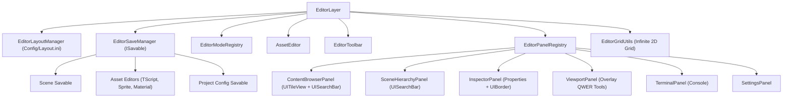

# Editor Subsystem Architecture

The Editor subsystem in TimeEngine powers the visual development workspace, managing editor workspace modes (`EditorMode`), modal asset editors (`AssetEditor`), toolbars (`EditorToolbar`), polymorphic save pipelines (`EditorSaveManager`), persistent layout management (`EditorLayoutManager`), and the modular retained-mode UI component system (`UIWidget`).

> [!NOTE]
> In short, think of the **Editor Subsystem** as the director's control room:
> - **Modular UI Framework**: Retained-mode tree hierarchy (`UIWidget`) providing reusable components (`UISearchBar`, `UITileView`, `UITreeView`, `UIContainers`).
> - **Universal Save Subsystem**: Polymorphic dirty tracking (`ISavable`, `EditorSaveManager`) for open-ended asset and scene saving.
> - **Layout & Docking Manager**: Project-local dockspace serialization (`EditorLayoutManager`) to `<ProjectDirectory>/Config/Layout.ini`.
> - **Viewport & Grid Tools**: Procedural infinite 2D world grid (`EditorGridUtils`) and floating overlay tools.

---

## Component Overview & Architecture



### Core Subsystems

1. **Modular UI Framework (`UIWidget` — `Engine/Include/UI/UIWidget.hpp`)**:
   - Retained-mode composite widget hierarchy with `AddChild`, `SetPosition`, `SetSize`, and `Draw` traversal.
   - Built-in components:
     - `UISearchBar`: Instant search input with clear button and regex/substring matching.
     - `UITileView`: Asset card grid with thumbnail rendering, type badges, and hover animations.
     - `UITreeView`: Collapsible hierarchy tree for scenes and complex trees.
     - `UIContainers`: `UIScrollBox`, `UIBorder` (glass card styling), `UIButton`, `UISlider`.

2. **Universal Polymorphic Save Subsystem (`ISavable` & `EditorSaveManager` — `Engine/Include/Editor/`)**:
   - `ISavable`: Open-ended interface for anything savable (Scenes, Scripts, Materials, Textures, Layouts).
   - `EditorSaveManager`: Coordinates dirty state tracking, auto-save timers, `SaveActive()` (`Ctrl+S`), and `SaveAll()` (`Ctrl+Shift+S`).

3. **Workspace Modes (`EditorMode` — `Engine/Include/Editor/EditorMode.hpp`)**:
   - Manages active editing state, fullscreen studio workspaces, viewport drawing, and toolbar actions.
   - Studio modes (e.g. `SpriteMode`, `SkeletalAnimationEditorMode`) request dedicated workspaces via `ShouldHideStandardPanels() = true` and `WantsFullscreenWorkspace() = true`, rendering full-screen UI containers with `TimeGUI::Begin("StudioName", ...)`.
   - Global registration: `EditorModeRegistry::RegisterMode<MyModeClass>()`.

4. **Decentralized Asset Editors (`AssetEditor` & `AssetEditorRegistry` — `Engine/Include/Editor/AssetEditorRegistry.hpp`)**:
   - Handles specialized editor tabs opened inside the editor dockspace (`EditorTab`).
   - Maps file extensions (`.png`, `.tetexture`, `.teui`, `.teaudio`, `.tetts`, `.terichtext`, `.tesoundgraph`, `.teskeleton`, etc.) to registered `AssetEditor` implementations:
     - `UIAssetEditor`: Visual UI tree, widget palette, live canvas preview (`.teui`, `.tecanvas`).
     - `AudioAssetEditor`: Sound clip transport, master volume mixer, output device selector (`.teaudio`, `.wav`, `.mp3`, `.ogg`).
     - `TTSAssetEditor`: Local offline text-to-speech prosody and acoustic markup (`.tetts`).
     - `RichTextAssetEditor`: BBCode and tag animation typewriter studio (`.terichtext`).
     - `SoundGraphAssetEditor`: Modular DSP node graph synthesizer and WAV baker (`.tesoundgraph`, `.tesynth`).
     - `SkeletalAssetEditor`: 2D bone hierarchy, rest pose inspector, animation scrubber (`.teskeleton`, `.tespine`).
   - Auto-registration macro: `TE_REGISTER_ASSET_EDITOR(EditorClass);`.
   - Global registration macro: `TE_REGISTER_ASSET_EDITOR(MyAssetEditor)`.

5. **Layout Persistence (`EditorLayoutManager` — `Engine/Include/Editor/EditorLayoutManager.hpp`)**:
   - Manages layout loading and saving to `<ProjectDirectory>/Config/Layout.ini`.
   - Constructs deterministic default dockspace topology (Center Viewport, Right Hierarchy/Properties, Bottom Browser/Terminal).

6. **Procedural World Grid & Viewport Tools (`EditorGridUtils` — `Engine/Include/Editor/EditorGridUtils.hpp`)**:
   - Procedural infinite 2D world grid that dynamically scales with camera zoom and panning.
   - Vector transform gizmo rendering ($Q, W, E, R$) and mouse middle/right drag navigation.

---

## Function Roles & Usage Guidelines

### 1. Universal Dirty Tracking & Saving (`EditorSaveManager`)

```cpp
// Register a custom asset or tool with the save coordinator
EditorSaveManager::RegisterSavable(myCustomSavable);

// Mark dirty when user modifies a property
myCustomSavable->MarkDirty(true);

// Trigger save on keybind (Ctrl+S / Ctrl+Shift+S)
EditorSaveManager::SaveAll();
```

### 2. Retained UI Components (`UISearchBar`, `UITileView`)

```cpp
// Instantiate retained search bar
auto searchBar = std::make_shared<UISearchBar>("Search assets...", "##MySearch");
searchBar->Draw();

// Filter list items instantly
if (searchBar->Matches(itemName)) {
    // Render item
}
```

### 3. Editor Mode System (`EditorModeRegistry`)

```cpp
TE::EditorModeRegistry::SetActiveMode("SpriteMode");
```
