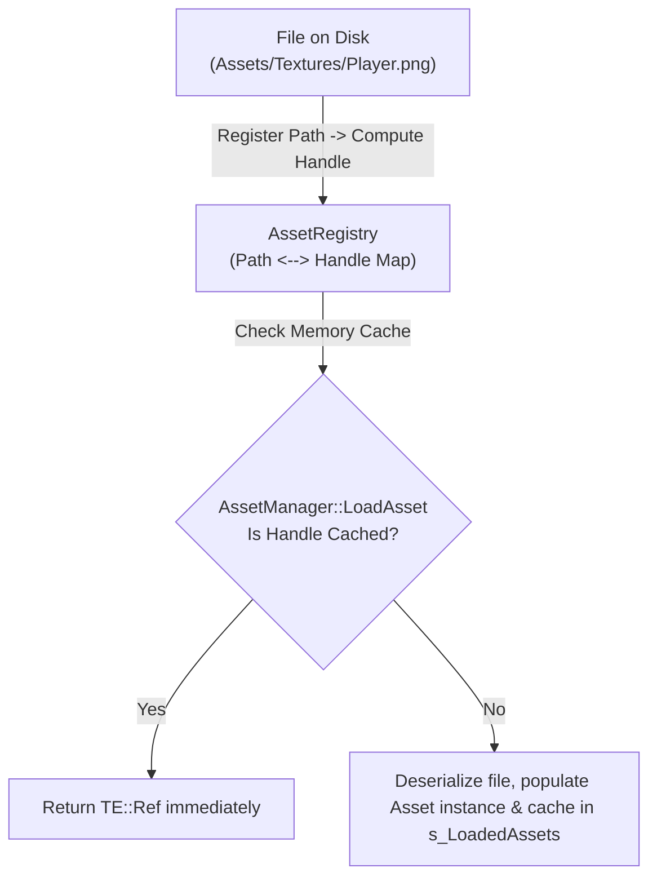

# Asset Subsystem Architecture

The Asset subsystem in TimeEngine provides 64-bit integer asset handles ([`AssetHandle`](../../../Include/Core/Asset/Asset.hpp)), prototype-based modular asset type registration (`AssetTypeMetadata`), global asset caching ([`AssetManager`](../../../Include/Core/Asset/AssetManager.hpp)), path-to-handle mapping ([`AssetRegistry`](../../../Include/Core/Asset/AssetRegistry.hpp)), and `stb_image` encapsulation (`ImportImage`, `ExportImagePNG`).

> [!NOTE]
> In short, think of the **Asset Subsystem** as the engine's library librarian: `Asset` is the base book interface, `AssetRegistry` maintains a card catalog mapping unique 64-bit handle IDs (`AssetHandle`) to physical file paths on disk, and `AssetManager` loads, caches, and dispenses asset instances into memory so files are never redundantly loaded twice.

---

## Subsystem Pipeline & Data Flow



---

## Core Classes & Subsystem Roles

1. **[`TE::Asset`](../../../Include/Core/Asset/Asset.hpp)**: Abstract base class for engine assets (`Scene`, `Texture`, `Material`, `Sprite`, `SpriteSheet`).
   - Virtual metadata methods (`GetType`, `GetName`, `GetDefaultExtension`, `GetDefaultIconPath`, `OnContentBrowserCreate`).

2. **[`TE::AssetManager`](../../../Include/Core/Asset/AssetManager.hpp)**: Central static manager for asset allocation and image file I/O.
   - Maintains memory cache `s_LoadedAssets` (`std::unordered_map<AssetHandle, TE::Ref<Asset>>`).
   - Prototype registry `s_AssetTypeRegistry` for extension icon resolution.
   - Encapsulates `stb_image` for PNG/JPG importing (`ImportImage`) and exporting (`ExportImagePNG`).

3. **[`TE::AssetRegistry`](../../../Include/Core/Asset/AssetRegistry.hpp)**: Bi-directional path-handle registry.
   - Maps `AssetHandle` $\leftrightarrow$ `std::filesystem::path`.
   - Persists registry mappings across project restarts.

---

## Key Functions & Usage Guidelines

### 1. Fetching & Loading Assets (`AssetManager`)

#### `AssetManager::LoadAsset(path)`
- **When Used**: Call when opening an asset from disk (Content Browser, double-click, or scene deserialization).
- **Behavior**: Checks `AssetRegistry` for handle ID, returns cached `AssetHandle` if already loaded in memory, or deserializes asset from disk.

```cpp
// Load texture from disk or memory cache
TE::AssetHandle handle = TE::AssetManager::LoadAsset("Assets/Textures/Player.png");
```

#### `AssetManager::GetAsset<T>(handle)`
- **When Used**: Retrieve a typed `TE::Ref<T>` pointer from a 64-bit `AssetHandle`.
- **When NOT to use**: Do NOT cast to derived type using raw `reinterpret_cast` — `GetAsset<T>` uses safe static pointer casting.

```cpp
auto texture = TE::AssetManager::GetAsset<TE::Texture>(handle);
if (texture) {
    renderer->DrawQuad(position, size, texture);
}
```

---

### 2. Registering Custom Asset Types (`RegisterAssetType`)

#### `AssetManager::RegisterAssetType(prototype)`
- **When Used**: Called during engine initialization (`AssetManager::Init`) or by plugin modules to register new file types.

```cpp
// Prototype registration maps type, extension, icon, and prototype instance
AssetManager::RegisterAssetType(TE::CreateRef<TE::Material>(nullptr));
```

---

### 3. Image Utilities (`ImportImage` & `ExportImagePNG`)

#### `AssetManager::ImportImage(filepath, desiredChannels)`
- **When Used**: Load raw image pixel bytes from disk into memory (`ImageData`) via `stb_image`. Must call `FreeImage(data)` after texture allocation!

#### `AssetManager::ExportImagePNG(path, width, height, channels, data)`
- **When Used**: Save raw pixel buffers (such as viewport screenshots or procedural textures) to PNG files on disk.

```cpp
// Save framebuffer screenshot to disk
TE::AssetManager::ExportImagePNG("Screenshots/Viewport.png", width, height, 4, pixelBuffer);
```

---

## Related Architectural Documentation

- [Project Subsystem Architecture](../Project/ARCHITECTURE.md) — Documentation for asset directory resolution.
- [Editor & Asset Editors Architecture](../../Editor/ARCHITECTURE.md) — Documentation for `AssetEditorRegistry` file inspectors.
