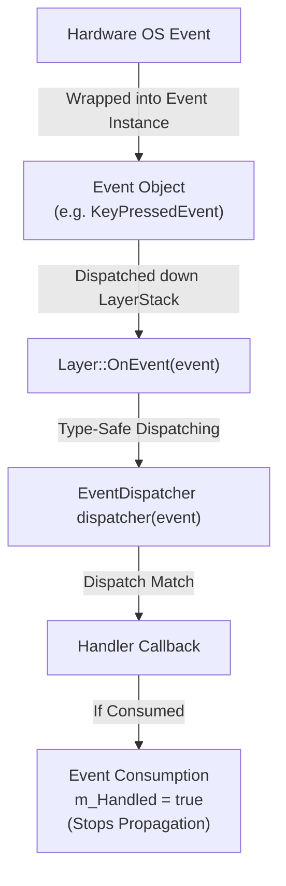

# Events Subsystem Architecture

The Events subsystem in TimeEngine provides blocking, category-filtered event objects ([`Event`](Event.h)), type-safe dispatching ([`EventDispatcher`](Event.h)), application state events ([`ApplicationEvent.h`](ApplicationEvent.h)), keyboard events ([`KeyEvent.h`](KeyEvent.h)), and mouse events ([`MouseEvent.h`](MouseEvent.h)).

> [!NOTE]
> In short, think of the **Events Subsystem** as the engine's internal messaging network: when something happens (like a key press, mouse move, or window resize), an `Event` envelope is created, passed down the layer stack, and unpacked by an `EventDispatcher` which calls the matching listener function.

---

## Subsystem Architecture & Pipeline



---

## Core Classes & Subsystem Roles

1. **[`TE::Event`](Event.h)**: Abstract base class for all event types.
   - Bit-flag categories (`EventCategoryApplication`, `EventCategoryInput`, `EventCategoryKeyboard`, `EventCategoryMouse`, `EventCategoryMouseButton`).
   - `m_Handled` boolean flag allowing layers to consume events and halt further propagation.

2. **[`TE::EventDispatcher`](Event.h)**: Type-safe template helper class used to route generic `Event&` objects to specific member functions based on static event types.

3. **Event Declarations**:
   - **`ApplicationEvent.h`**: `WindowResizeEvent`, `WindowCloseEvent`, `WindowFocusEvent`, `WindowLostFocusEvent`, `AppTickEvent`, `AppUpdateEvent`, `AppRenderEvent`.
   - **`KeyEvent.h`**: `KeyPressedEvent` (with repeat count tracking), `KeyReleasedEvent`, `KeyTypedEvent`.
   - **`MouseEvent.h`**: `MouseMovedEvent` ($X, Y$), `MouseScrolledEvent` ($X, Y$ offsets), `MouseButtonPressedEvent`, `MouseButtonReleasedEvent`.

---

## Key Functions & Usage Guidelines

### 1. Event Dispatching (`EventDispatcher`)

#### `EventDispatcher::Dispatch<T>(callback)`
- **When Used**: Inside `OnEvent(Event& e)` overrides across engine layers (e.g. `EditorLayer::OnEvent`).
- **Behavior**: Checks if `e.GetEventType() == T::GetStaticType()`. If it matches, casts the event to `T&`, invokes `callback(T&)`, and sets `e.m_Handled |= result`.

```cpp
void EditorLayer::OnEvent(TE::Event& e)
{
    TE::EventDispatcher dispatcher(e);

    // Route WindowResizeEvent to OnWindowResize member function
    dispatcher.Dispatch<TE::WindowResizeEvent>(
        [this](TE::WindowResizeEvent& event) -> bool {
            return OnWindowResize(event); // Return true if event was consumed!
        }
    );
}
```

---

### 2. Event Consumption & Filtering (`m_Handled`)

#### `event.Handled()`
- **When Used**: Check if an event was already processed by a higher-priority overlay layer (like `TimeGUILayer` or `ProfilingLayer`).
- **Rule**: If `e.Handled()` is `true`, lower layers in the `LayerStack` MUST skip processing the event.

```cpp
void EditorLayer::OnEvent(TE::Event& e)
{
    // If ImGui captured mouse/keyboard, stop event from reaching viewport camera
    if (e.Handled())
        return;

    m_ViewportCamera.OnEvent(e);
}
```

---

## Related Architectural Documentation

- [Layers Subsystem Architecture](../Layers/ARCHITECTURE.md) — Documentation for top-to-bottom event propagation down the `LayerStack`.
- [Window Subsystem Architecture](../../Window/ARCHITECTURE.md) — GLFW callbacks and event creation.
- [Input Subsystem Architecture](../../Input/ARCHITECTURE.md) — Direct input state queries and action mapping.
