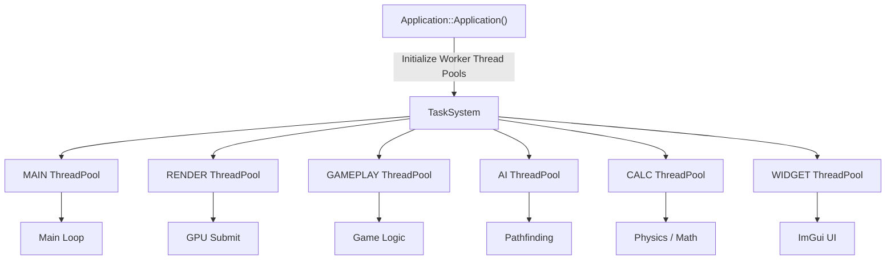

# Multi-Threading & Task System Architecture

The Multi-Threading subsystem in TimeEngine provides dedicated thread pools ([`ThreadPool`](ThreadPool.hpp)), task-type queue scheduling ([`TaskSystem`](TaskSystem.hpp)), and submission macros and concurrency primitives ([`Threading.hpp`](Threading.hpp)).

> [!NOTE]
> In short, think of the **Multi-Threading Subsystem** as the engine's multi-core task dispatcher: instead of running heavy computations on the main thread, `TaskSystem` maintains 6 specialized thread pools (Main, Render, Gameplay, AI, Calculation, Widget) and provides macro helpers (`SUBMIT_CALC`, `SUBMIT_AI`, `SUBMIT_RENDER`) to execute asynchronous jobs safely across CPU cores.

---

## Threading Architecture & Dedicated Pools



---

## Core Classes & Component Roles

1. **[`TaskSystem`](TaskSystem.hpp)**:
   - Central static job dispatcher mapping `TaskType` enums (`MAIN`, `RENDER`, `GAMEPLAY`, `AI`, `CALC`, `WIDGET`) to dedicated `ThreadPool` instances.
   - Manages thread pool state toggles (`SetThreadEnabled`) and thread restarts (`RestartThread`).

2. **[`ThreadPool`](ThreadPool.hpp)**:
   - Worker thread container spawning `std::thread::hardware_concurrency()` threads.
   - Uses `std::mutex`, `std::condition_variable`, and `std::queue<std::function<void()>>` for thread-safe work-stealing job queues.

3. **[`Threading.hpp`](Threading.hpp)**:
   - Ergonomic macro suite (`INIT_MAIN_THREAD`, `SUBMIT_CALC`, `SUBMIT_AI`, etc.) and fear-free concurrency wrappers (`TEMutex`, `TERwLock`, `TEChannel`).

---

## Submission Macros & Usage Guidelines

### 1. Engine Initialization (`INIT_*`)
Called automatically inside `Application::Application()`:
- `INIT_MAIN_THREAD()`
- `INIT_RENDER_THREAD()`
- `INIT_GAMEPLAY_THREAD()`
- `INIT_AI_THREAD()`
- `INIT_CALC_THREAD()`
- `INIT_WIDGET_THREAD()`

---

### 2. Submitting Asynchronous Jobs

#### `SUBMIT_CALC(job)`
- **When Used**: Offload heavy mathematical calculations, procedural mesh generation, or physics sub-stepping to worker threads.

```cpp
SUBMIT_CALC([this]() {
    // Heavy math calculation on background CALC thread
    CalculateComplexNoise();
});
```

#### `SUBMIT_AI(job)`
- **When Used**: Run AI pathfinding algorithms (A* search, navigation mesh queries) or behavior tree evaluations off the main thread.

```cpp
SUBMIT_AI([npcEntity]() {
    // Asynchronous A* pathfinding evaluation
    npcEntity->ComputePathToPlayer();
});
```

#### `SUBMIT_RENDER(job)`
- **When Used**: Enqueue asynchronous texture decoding or material pipeline compilation tasks.

---

## Fearless Concurrency ([`Threading.hpp`](Threading.hpp))

TimeEngine provides memory-safe, Rust-inspired synchronization and communication primitives:

### 1. `TEMutex<T>` (Protected Value Mutex)
Wraps inner data so that it is structurally impossible to access `T` without acquiring an RAII `Guard`:

```cpp
TEMutex<std::vector<int>> protectedList;

{
    auto guard = protectedList.Lock();
    guard->push_back(42); // Value accessed via RAII Guard operator-> or *
} // Mutex automatically unlocked when guard exits scope
```

### 2. `TERwLock<T>` (Multiple Readers, Single Writer Lock)
Matches Rust's `RwLock<T>`, granting concurrent read access via `ReadGuard` and exclusive write access via `WriteGuard`:

```cpp
TERwLock<GameState> gameState;

// Concurrent readers
{
    auto reader = gameState.Read();
    std::cout << reader->Score << std::endl;
}

// Exclusive writer
{
    auto writer = gameState.Write();
    writer->Score += 100;
}
```

### 3. `TEChannel<T>` (MPSC Message Passing Channel)
Thread-safe multi-producer single-consumer channel for communicating sequential processes without shared mutable state:

```cpp
TEChannel<AudioCommand> audioQueue;

// Producer (e.g. Gameplay Thread)
audioQueue.Send(PlaySoundEvent{"Explosion.wav"});

// Consumer (e.g. Audio / Calc Thread)
if (auto cmd = audioQueue.Receive()) {
    ProcessAudio(*cmd);
}
```

---

## Related Architectural Documentation

- [Core Subsystem Architecture](../../../src/Core/ARCHITECTURE.md) — Main engine application loop.
- [2D Physics Architecture](../../../src/Core/Physics/ARCHITECTURE.md) — Asynchronous physics integration.
- [Root Architecture Index](../../../../Docs/ARCHITECTURE.md) — Master TimeEngine architecture hub.

