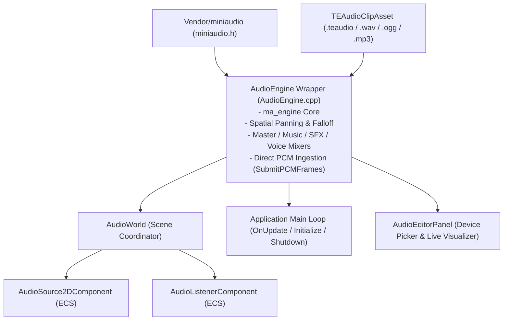

# Audio Subsystem Architecture (`Engine/src/Core/Audio/`)

The **Audio Subsystem** provides multi-platform, deterministic, and spatial 2D audio processing for TimeEngine powered by an embedded `miniaudio` backend.

---

## 🏛️ Architecture Flowchart

---

## 🔑 Key Components

1. **`AudioEngine` (`AudioEngine.hpp / .cpp`)**:
   - Central static API isolating all `miniaudio` vendor functions, handles, and headers.
   - Manages loaded audio clips (`AudioClipHandle`), hardware playback devices, listener positions, and time-dilation pitch scaling.
   - Provides `SubmitPCMFrames` for procedural synthesis or text-to-speech audio streams.

2. **`AudioWorld` (`AudioWorld.hpp / .cpp`)**:
   - Scene-level coordinator managing all active audio source and listener components.
   - Automatically starts `PlayOnStart` sounds during `Scene::OnRuntimeStart()`.

3. **`AudioSource2DComponent` (`AudioSource2DComponent.hpp / .cpp`)**:
   - Entity-level sound emitter supporting 2D spatial attenuation (inverse, linear, exponential falloff curves), min/max distance clamping, volume, pitch, looping, and pan controls.

4. **`AudioListenerComponent` (`AudioListenerComponent.hpp / .cpp`)**:
   - Synchronizes entity world position with `AudioEngine::SetListenerPosition` each frame to calculate spatial audio falloff relative to the camera or player.

5. **`TEAudioClipAsset` (`TEAudioClipAsset.hpp / .cpp`)**:
   - Registered AssetManager type for sound clips (`.wav`, `.ogg`, `.mp3`, `.flac`, `.teaudio`).
