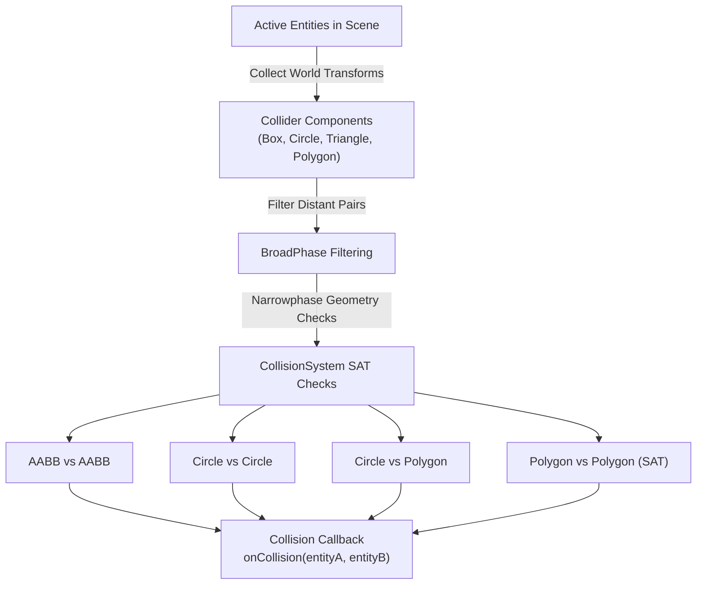

# 2D Collision Subsystem Architecture

The 2D Collision subsystem in TimeEngine handles broadphase spatial filtering ([`BroadPhase`](../../../Include/Core/Collision/BroadPhase.hpp)), narrowphase geometric overlap detection using the Separating Axis Theorem (SAT) ([`CollisionSystem`](../../../Include/Core/Collision/CollisionSystem.hpp)), shape bounds ([`CollisionTypes.hpp`](../../../Include/Core/Collision/CollisionTypes.hpp)), and collider components (`BoxColliderComponent`, `CircleColliderComponent`, `TriangleColliderComponent`, `PolygonColliderComponent`).

> [!NOTE]
> In short, think of the **Collision Subsystem** as the game's touch sensor and boundary detector: `BroadPhase` quickly filters out pairs of objects that are nowhere near each other, while `CollisionSystem` performs precise mathematical checks (AABB vs AABB, Circle vs Circle, SAT Polygon vs Polygon) to detect collisions and fire `onCollision` callbacks.

---

## Subsystem Pipeline & Data Flow



---

## Core Classes & Subsystem Roles

1. **[`TE::CollisionShape`](../../../Include/Core/Collision/CollisionTypes.hpp)**:
   - Unified shape container holding `CollisionType` enum (`AABB`, `Circle`, `Triangle`, `Polygon`).
   - Stores geometric bounds structures (`BoundsAABB`, `BoundsCircle`, `BoundsTriangle`, `BoundsPolygon`).

2. **[`TE::BroadPhase`](../../../Include/Core/Collision/BroadPhase.hpp)**:
   - Performs initial spatial pruning to generate potential colliding entity pairs (`EntityPair`).

3. **[`TE::CollisionSystem`](../../../Include/Core/Collision/CollisionSystem.hpp)**:
   - Central collision manager executing narrowphase geometry intersection algorithms.
   - Computes world-space transformations for nested component hierarchies.
   - Triggers `onCollision` std::function callback upon intersection.

4. **Collider Components**:
   - **`BoxColliderComponent`**: 2D rectangular AABB bounding collider.
   - **`CircleColliderComponent`**: 2D radial circle collider.
   - **`TriangleColliderComponent`**: 3-vertex triangular polygon collider.
   - **`PolygonColliderComponent`**: Arbitrary convex $N$-vertex polygon collider.

---

## Key Algorithms & Usage Guidelines

### 1. `CollisionSystem::Process()`
- **When Used**: Called every frame inside `Scene::OnUpdateRuntime(dt)` to update component world transforms (`OnUpdateShape`), run broadphase filtering, and evaluate narrowphase collisions.

---

### 2. Geometric Intersection Algorithms

#### AABB vs AABB (`CollisionSystem::AABBvsAABB`)
- **Algorithm**: Axis-aligned box min/max overlap check.
- **When Preferred**: Extremely fast ($O(1)$) check used for simple rectangular boundaries or fast rejection.

```cpp
bool CollisionSystem::AABBvsAABB(const BoundsAABB &a, const BoundsAABB &b) {
    return !(a.max.x < b.min.x || a.min.x > b.max.x || a.max.y < b.min.y || a.min.y > b.max.y);
}
```

#### Circle vs Circle (`CollisionSystem::CircleVsCircle`)
- **Algorithm**: Distance squared comparison against combined radiuses $(r_A + r_B)^2 \ge dx^2 + dy^2$.
- **When Preferred**: Fast ($O(1)$) distance check avoiding square roots.

```cpp
bool CollisionSystem::CircleVsCircle(const BoundsCircle &a, const BoundsCircle &b) {
    float r = a.radius + b.radius;
    float dx = a.center.x - b.center.x;
    float dy = a.center.y - b.center.y;
    return (dx * dx + dy * dy) <= r * r;
}
```

#### Polygon vs Polygon (`CollisionSystem::PolyVsPoly`) — SAT
- **Algorithm**: Separating Axis Theorem (SAT). Projects polygon vertices onto perpendicular edge normals (`GetAxes`) and checks for 1D scalar interval overlaps (`Project`).
- **When Preferred**: Precise collision detection between triangles, rotated boxes, and complex convex 2D polygons.

---

### 3. Collision Callbacks

#### `CollisionSystem::onCollision(entityA, entityB)`
- **When Used**: Register callback function to handle gameplay responses (like dealing damage, playing collision sound effects, or destroying projectiles).

```cpp
collisionSystem->onCollision = [](EntityID a, EntityID b) {
    TE_CORE_INFO("Collision detected between Entity {0} and Entity {1}", a, b);
};
```

---

## Related Architectural Documentation

- [2D Physics Architecture](../Physics/ARCHITECTURE.md) — Documentation for 2D rigid body dynamics and impulse resolution.
- [Scene & ECS Architecture](../Scene/ARCHITECTURE.md) — Documentation for entity lifespan and component management.
