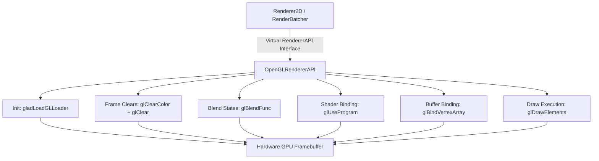

# OpenGL Graphics Backend Architecture

The OpenGL graphics backend in TimeEngine provides cross-platform OpenGL hardware rendering (`OpenGLRendererAPI`), GLAD function pointer loading (`LoadLoader`), GLSL shader compilation ([`OpenGLShader`](../../../Include/Renderer/OpenGL/OpenGLShader.hpp)), OpenGL Vertex Array Objects ([`OpenGLVertexArray`](../../../Include/Renderer/OpenGL/OpenGLVertexArray.hpp)), Vertex Buffers ([`OpenGLVertexBuffer`](../../../Include/Renderer/OpenGL/OpenGLVertexBuffer.hpp)), Index Buffers ([`OpenGLIndexBuffer`](../../../Include/Renderer/OpenGL/OpenGLIndexBuffer.hpp)), Framebuffers ([`OpenGLFramebuffer`](../../../Include/Renderer/OpenGL/OpenGLFramebuffer.hpp)), and pixel readbacks (`glReadPixels`).

> [!NOTE]
> In short, think of the **OpenGL Backend** as TimeEngine's cross-platform graphics driver wrapper: `OpenGLRendererAPI` translates standard engine render commands into native OpenGL calls (`glViewport`, `glClear`, `glDrawElements`, `glBlendFunc`), while `gladLoadGLLoader` dynamically binds modern OpenGL function pointers from GLFW context loaders.

---

## Architecture & Data Flow



---

## Core Classes & Subsystem Roles

1. **[`TE::OpenGLRendererAPI`](../../../Include/Renderer/OpenGL/OpenGLRendererAPI.hpp)**:
   - Inherits from `RendererAPI`.
   - Initializes OpenGL state machine defaults (`glEnable(GL_BLEND)`).
   - Queries hardware information (`glGetString(GL_VERSION)`, `GL_VENDOR`, `GL_RENDERER`).
   - Executes primitive indexed draw calls (`glDrawElements`).

2. **[`TE::OpenGLShader`](../../../Include/Renderer/OpenGL/OpenGLShader.hpp)**:
   - Compiles Vertex and Fragment GLSL shader source strings using `glCompileShader()`.
   - Links shader programs via `glLinkProgram()` and caches uniform locations (`glGetUniformLocation()`).

3. **[`TE::OpenGLFramebuffer`](../../../Include/Renderer/OpenGL/OpenGLFramebuffer.hpp)**:
   - Allocates off-screen OpenGL Framebuffer Objects (FBO) with color texture attachments (`GL_COLOR_ATTACHMENT0`) and depth/stencil renderbuffers.

4. **Resource Objects**:
   - **`OpenGLVertexArray`**: Manages `glGenVertexArrays`, `glBindVertexArray`, and `glVertexAttribPointer` vertex attribute layouts.
   - **`OpenGLVertexBuffer`**: Manages `glGenBuffers`, `glBindBuffer(GL_ARRAY_BUFFER)`, and `glBufferData`.
   - **`OpenGLIndexBuffer`**: Manages `glGenBuffers`, `glBindBuffer(GL_ELEMENT_ARRAY_BUFFER)`, and index buffer uploads.

---

## Core Functions & Usage Guidelines

### 1. Function Pointer Loading (`LoadLoader`)

#### `OpenGLRendererAPI::LoadLoader(loadProc)`
- **When Used**: Called during engine startup inside `Application::Application()`.
- **What it does**: Binds modern OpenGL function pointers from GLFW native window loader via `gladLoadGLLoader((GLADloadproc)loadProc)`.

```cpp
RenderCommand::LoadLoader((void *(*)(const char *))m_Window->GetGLLoaderFunction());
```

---

### 2. Viewport & Clear Controls

#### `OpenGLRendererAPI::SetViewport(x, y, width, height)` & `Clear()`
- **When Used**: Invoked during window resizing and at the beginning of every frame render pass.
- **Commands**: `glViewport(x, y, width, height)` and `glClear(GL_COLOR_BUFFER_BIT | GL_DEPTH_BUFFER_BIT)`.

---

### 3. Blend State Modes (`SetBlendMode`)

- **`blendMode == 0` (Normal Alpha)**:
  - `glBlendFunc(GL_SRC_ALPHA, GL_ONE_MINUS_SRC_ALPHA);`
  - `glEnable(GL_DEPTH_TEST);`
- **`blendMode == 1` (Additive Lighting)**:
  - `glBlendFunc(GL_ONE, GL_ONE);`
  - `glDisable(GL_DEPTH_TEST);`
- **`blendMode == 2` (Multiplicative)**:
  - `glBlendFunc(GL_DST_COLOR, GL_ZERO);`
  - `glDisable(GL_DEPTH_TEST);`

---

### 4. Framebuffer Pixel Reading

#### `OpenGLRendererAPI::ReadPixelsRGBA(x, y, width, height, outPixels)`
- **When Used**: Invoked when capturing viewport screenshots or reading framebuffers to CPU memory.
- **Command**: `glReadPixels(x, y, width, height, GL_RGBA, GL_UNSIGNED_BYTE, outPixels)`.

---

## Related Architectural Documentation

- [Renderer Subsystem Architecture](../ARCHITECTURE.md) — Multi-backend 2D batching architecture.
- [DirectX 11 Graphics Backend Architecture](../DirectX11/ARCHITECTURE.md) — Direct3D 11 hardware backend implementation.
- [Window Subsystem Architecture](../../Window/ARCHITECTURE.md) — GLFW window creation and OpenGL context initialization.
