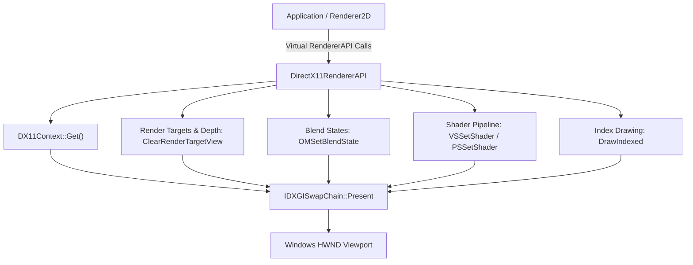

# DirectX 11 Graphics Backend Architecture

The DirectX 11 graphics backend in TimeEngine provides a high-performance Direct3D 11 rendering pipeline implementation (`DirectX11RendererAPI`), shared COM device contexts ([`DX11Context`](../../../Include/Renderer/DirectX11/DirectX11RendererAPI.hpp)), HLSL shader compilation ([`DirectX11Shader`](../../../Include/Renderer/DirectX11/DirectX11Shader.hpp)), D3D11 vertex buffers ([`DirectX11VertexBuffer`](../../../Include/Renderer/DirectX11/DirectX11VertexBuffer.hpp)), index buffers ([`DirectX11IndexBuffer`](../../../Include/Renderer/DirectX11/DirectX11IndexBuffer.hpp)), vertex input layouts ([`DirectX11VertexArray`](../../../Include/Renderer/DirectX11/DirectX11VertexArray.hpp)), and viewport pixel reading (`ReadPixelsRGBA`).

> [!NOTE]
> In short, think of the **DirectX 11 Backend** as TimeEngine's native Windows hardware driver module: `DX11Context` manages the `ID3D11Device`, `ID3D11DeviceContext`, and `IDXGISwapChain`; `DirectX11RendererAPI` maps vendor-agnostic engine render commands (`SetViewport`, `Clear`, `SetBlendMode`) into D3D11 calls; while HLSL shaders are compiled dynamically using `D3DCompile` at runtime.

---

## Architecture & Data Flow



---

## Core Classes & Component Roles

1. **[`TE::DX11Context`](../../../Include/Renderer/DirectX11/DirectX11RendererAPI.hpp)**:
   - Global singleton struct maintaining COM pointers for all D3D11 resource objects:
     - `ID3D11Device *Device`: Resource allocation factory.
     - `ID3D11DeviceContext *DeviceContext`: Command execution context.
     - `IDXGISwapChain *SwapChain`: DXGI swap chain buffer manager.
     - `ID3D11RenderTargetView *RenderTargetView`: Backbuffer color view.
     - `ID3D11DepthStencilView *DepthStencilView`: Depth-stencil surface view.

2. **[`TE::DirectX11RendererAPI`](../../../Include/Renderer/DirectX11/DirectX11RendererAPI.hpp)**:
   - Inherits from `RendererAPI`.
   - Binds native Windows handle (`HWND`) via `InitWithWindow(hwnd, width, height)`.
   - Manages viewport scaling, clear colors, hardware GPU queries (`GetGPUVendor`), and blend states.

3. **[`TE::DirectX11Shader`](../../../Include/Renderer/DirectX11/DirectX11Shader.hpp)**:
   - Compiles HLSL source strings dynamically at runtime using `D3DCompile()`.
   - Creates `ID3D11VertexShader`, `ID3D11PixelShader`, and constant buffer bindings.

4. **Resource Wrappers**:
   - **`DirectX11VertexBuffer`**: Creates `ID3D11Buffer` with `D3D11_BIND_VERTEX_BUFFER`.
   - **`DirectX11IndexBuffer`**: Creates `ID3D11Buffer` with `D3D11_BIND_INDEX_BUFFER`.
   - **`DirectX11VertexArray`**: Creates `ID3D11InputLayout` from vertex buffer elements and shader bytecodes.

---

## Core Functions & Usage Guidelines

### 1. Context & Swap Chain Initialization

#### `DirectX11RendererAPI::InitWithWindow(hwnd, width, height)`
- **When Used**: Invoked by `WindowsWindow` after creating the Win32 `HWND`.
- **What it does**: Calls `D3D11CreateDeviceAndSwapChain()`, configures `DXGI_FORMAT_R8G8B8A8_UNORM`, queries GPU hardware strings via `IDXGIAdapter::GetDesc()`, and creates default alpha blend states (`D3D11_BLEND_SRC_ALPHA`, `D3D11_BLEND_INV_SRC_ALPHA`).

```cpp
// Initialize D3D11 device and swap chain from native window handle
auto dx11API = std::make_shared<TE::DirectX11RendererAPI>();
dx11API->InitWithWindow(nativeHwnd, 1920, 1080);
```

---

### 2. Viewport & Clear Controls

#### `DirectX11RendererAPI::Clear()`
- **When Used**: Invoked at the start of every frame inside `Application::Run()`.
- **What it does**: Clears color backbuffer view via `ClearRenderTargetView()` and depth buffer via `ClearDepthStencilView()`.

---

### 3. Blend State Configuration

#### `DirectX11RendererAPI::SetBlendMode(blendMode)`
- **`blendMode == 0` (Normal Alpha)**:
  - `SrcBlend = D3D11_BLEND_SRC_ALPHA`, `DestBlend = D3D11_BLEND_INV_SRC_ALPHA`
- **`blendMode == 1` (Additive)**:
  - `SrcBlend = D3D11_BLEND_ONE`, `DestBlend = D3D11_BLEND_ONE`
- **`blendMode == 2` (Multiplicative)**:
  - `SrcBlend = D3D11_BLEND_DEST_COLOR`, `DestBlend = D3D11_BLEND_ZERO`

---

### 4. Framebuffer Pixel Extraction

#### `DirectX11RendererAPI::ReadPixelsRGBA(x, y, width, height, outPixels)`
- **When Used**: Invoked by viewport screenshot tools (`Tool_GetViewportScreenshot`) or asset creators.
- **Mechanism**: Creates a staging texture (`D3D11_USAGE_STAGING` with `D3D11_CPU_ACCESS_READ`), copies backbuffer data via `CopyResource()`, maps memory via `ID3D11DeviceContext::Map()`, and flips row order vertically to match OpenGL convention ($y=0$ at bottom-left).

---

## Related Architectural Documentation

- [Renderer Subsystem Architecture](../ARCHITECTURE.md) — Multi-backend 2D batching pipeline.
- [Window Subsystem Architecture](../../Window/ARCHITECTURE.md) — Win32 `HWND` creation and event dispatch.
- [Windows Platform Utilities Architecture](../../Utils/Platform/Windows/ARCHITECTURE.md) — Win32 system dialogs and COM initialization.
