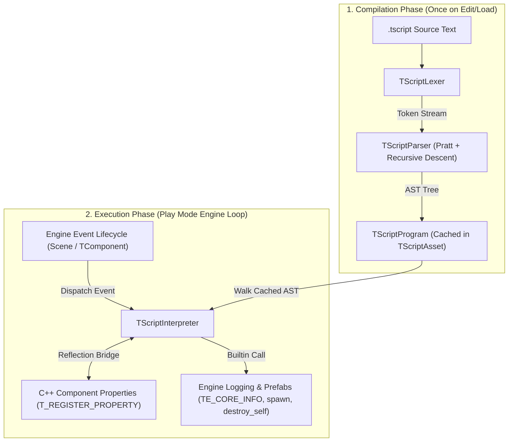

# TScript Scripting Subsystem Architecture

This document details the architecture, design principles, execution pipeline, and C++ binding bridge of **TScript**: TimeEngine's embedded, zero-dependency, source-text-first, event-driven scripting language.

> [!NOTE]
> **TScript** is designed to provide determinism, instant source-text editing, zero binary blob storage, and seamless C++ reflection integration.

---

## 🏗️ Architectural Overview & Pipeline

TScript operates as a two-phase engine:
1. **Compilation Phase (Once per Edit/Load)**: Source `.tscript` code is tokenized by `TScriptLexer` and parsed into an Abstract Syntax Tree (`TScriptProgram`) by `TScriptParser`. The compiled AST is cached inside a `TScriptAsset`.
2. **Execution Phase (Per Frame / Event)**: `TScriptInterpreter` walks the cached AST to evaluate expressions, execute statements, and trigger event callbacks (`on_ready`, `on_update`, `on_collision`, `on_input`, `on_timer`, `on_destroy`).

---

## 🔑 Core Components

### 1. Data Type System (`TScriptValue`)
* Files: [`TScriptValue.hpp`](../../../Include/Core/Scripting/TScriptValue.hpp), [`TScriptValue.cpp`](TScriptValue.cpp)
* Encapsulates dynamic values using `std::variant<std::monostate, bool, double, std::string, TEVector2, TScriptEntityRef>`.
* Converts numbers automatically between `int` and `double`.
* Evaluates truthiness and dynamic string formatting for debugging/logging.

### 2. Abstract Syntax Tree (`TScriptAST`)
* File: [`TScriptAST.hpp`](../../../Include/Core/Scripting/TScriptAST.hpp)
* Node Hierarchy:
  * `LiteralNode`, `VariableNode`, `AssignNode`
  * `PropertyAccessNode` / `PropertySetNode` (e.g. `transform.position.x += 10.0`)
  * `BinaryOpNode`, `UnaryOpNode`, `CallNode`
  * `BlockNode`, `IfNode`, `WhileNode`, `ForRangeNode`, `ForCStyleNode`, `ReturnNode`
  * `VarDeclNode`, `PropertyDeclNode` (`T_REGISTER_PROPERTY`)
  * `AccessModifierNode` (`public:`, `private:`, `protected:`)
  * `EventFuncNode` (`on_ready`, `on_update`, etc.)
  * `ClassDeclNode` (`class PlayerScript : TComponent`)

### 3. Lexical Analyzer (`TScriptLexer`)
* Files: [`TScriptLexer.hpp`](../../../Include/Core/Scripting/TScriptLexer.hpp), [`TScriptLexer.cpp`](TScriptLexer.cpp)
* Skips C (`//`) and Python (`#`) single-line comments as well as multi-line `/* */` comments.
* Tokenizes operators (`+`, `-`, `*`, `/`, `%`, `**`, `&&`, `||`, `!`) and keyword aliases (`and`, `or`, `not`).

### 4. Parser (`TScriptParser`)
* Files: [`TScriptParser.hpp`](../../../Include/Core/Scripting/TScriptParser.hpp), [`TScriptParser.cpp`](TScriptParser.cpp)
* Pratt precedence-climbing parser for expressions combined with recursive-descent statement parsing.
* Handles colon inheritance syntax (`class Enemy : TComponent, IDamageable`) without forcing closing braces on class declarations.

### 5. Interpreter & Binding Bridge (`TScriptInterpreter`)
* Files: [`TScriptInterpreter.hpp`](../../../Include/Core/Scripting/TScriptInterpreter.hpp), [`TScriptInterpreter.cpp`](TScriptInterpreter.cpp)
* Dispatches lifecycle events (`DispatchReady`, `DispatchUpdate`, `DispatchCollision`, `DispatchInput`, `DispatchTimer`, `DispatchDestroy`).
* Exposes C++ macro logging (`TE_CORE_INFO`, `TE_CORE_WARN`, `TE_CORE_ERROR`) and math helpers (`min`, `max`, `abs`, `sqrt`, `lerp`).
* Features `SnapshotVariables()` and `RestoreVariables()` for deterministic time-rewind state preservation.

### 6. Script Asset (`TScriptAsset`)
* Files: [`TScriptAsset.hpp`](../../../Include/Core/Scripting/TScriptAsset.hpp), [`TScriptAsset.cpp`](TScriptAsset.cpp)
* Subclasses `Asset` with extension `.tscript`.
* Manages `Recompile()` logic and syntax error diagnostics.

---

## ⏱️ Time Rewind & Determinism Architecture

To remain compatible with TimeEngine's core vision, `TScriptInterpreter` avoids non-deterministic side-effects and external heap pointer state. Variable snapshots (`SnapshotVariables()`) capture a full dictionary of current script values (`m_Globals`). During rewind/playback, restoring this map (`RestoreVariables()`) seamlessly reverts script variables back to past states.

---

## 📚 User Guide & Documentation

* 📘 **[TScript User Manual & Language Reference](TScriptUserGuide.md)** — Complete developer guide covering syntax, lifecycle event hooks, property inspector exposure (`T_REGISTER_PROPERTY`), and examples.

