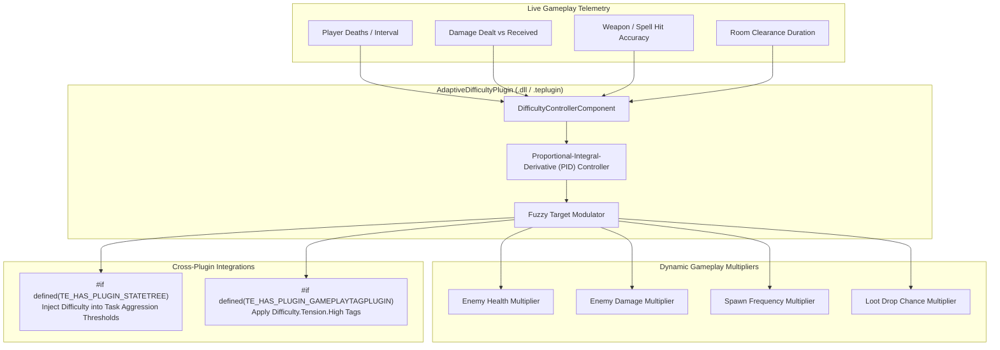

# AdaptiveDifficultyPlugin Architecture

The `AdaptiveDifficultyPlugin` provides a real-time Dynamic Difficulty Adjustment (DDA) control loop to keep the player in their psychological flow zone by monitoring skill metrics and modulating game challenge.

---

## 🏛️ System Architecture Flowchart

---

## 🛠️ Contributor Implementation Guide

- Implement telemetry aggregation in `DifficultyControllerComponent::RecordDamageDealt()`, `RecordDeath()`, and `RecordShot()`.
- Implement PID error calculation ($e(t) = \text{TargetFlowRatio} - \text{ObservedSkillScore}$) in `src/Controllers/PIDDifficultyController.cpp`.
- Expose difficulty multipliers to TScript and StateTree conditions.
