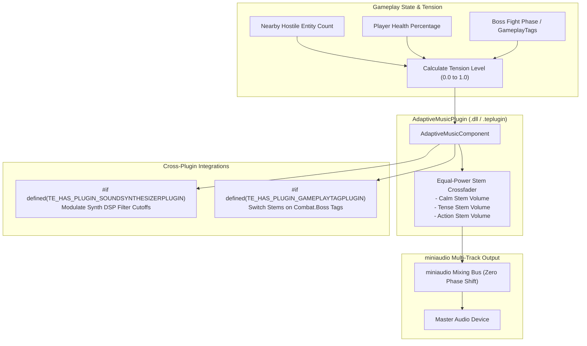

# AdaptiveMusicPlugin Architecture

The `AdaptiveMusicPlugin` modulates interactive musical intensity, tempo, and stem crossfading in real time based on player tension and combat states using TimeEngine's native `miniaudio` backend.

---

## 🏛️ System Architecture Flowchart

---

## 🛠️ Contributor Implementation Guide

- Implement equal-power volume curves in `AdaptiveMusicComponent::SetTension()` ($V_{\text{calm}} = \cos(\theta)$, $V_{\text{action}} = \sin(\theta)$).
- Feed stem buffers directly to `miniaudio` audio pipelines.
- Modulate DSP filter frequencies when `#if defined(TE_HAS_PLUGIN_SOUNDSYNTHESIZERPLUGIN)` is active.
