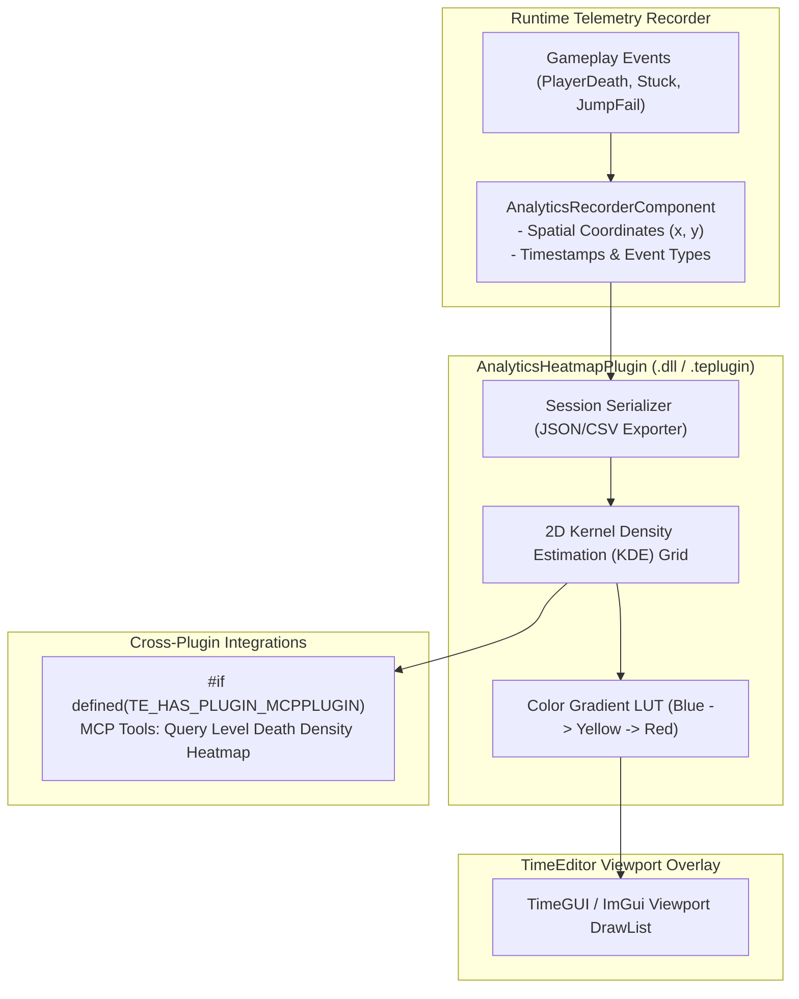

# AnalyticsHeatmapPlugin Architecture

The `AnalyticsHeatmapPlugin` captures spatial player gameplay events (deaths, item pickups, failed jumps) and computes 2D Kernel Density Estimation (KDE) to render color-coded heatmaps over the **TimeEditor** viewport.

---

## 🏛️ System Architecture Flowchart

---

## 🛠️ Contributor Implementation Guide

- Implement `AnalyticsRecorderComponent::RecordEvent()` to push timestamped points into a ring buffer.
- Implement Gaussian 2D KDE in `src/KDE/KernelDensityEstimator.cpp`.
- Render heatmap quads using `TimeGUIDrawList::AddRectFilled()` with alpha blending.
