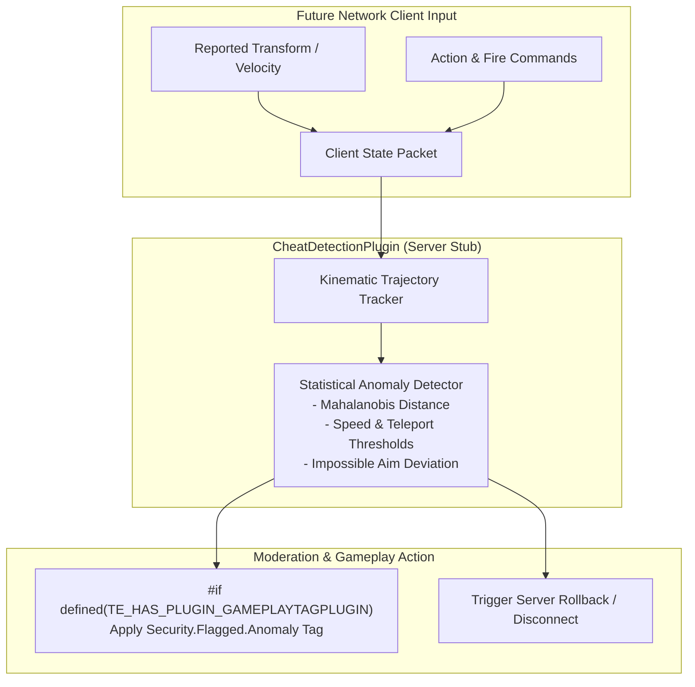

# CheatDetectionPlugin Architecture (Future Stub)

> [!NOTE]
> **Status**: Architectural Stub / Future Roadmap Item. Multiplayer networking is not yet part of TimeEngine core. This plugin provides the interface specifications and anomaly detection design for future server-authoritative validation.

---

## 🏛️ System Architecture Flowchart

---

## 🛠️ Contributor Implementation Guide

- Implement trajectory delta validation in `src/Validators/KinematicValidator.cpp`.
- Connect anomaly flags to GameplayTags when networking is introduced.
