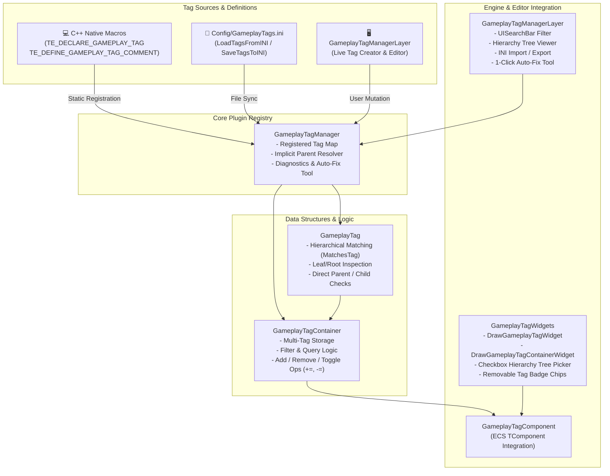

# GameplayTagPlugin Architecture

The `GameplayTagPlugin` module provides a standalone, opt-in hierarchical tag system for TimeEngine entities and systems.

> [!NOTE]
> Hierarchical gameplay tags allow coarse or granular queries against entity properties. For example, querying `has_tag("Character.Enemy")` matches entities with tags like `Character.Enemy.Boss.Dragon` or `Character.Enemy.Minion`.

---

## 🏛️ Gameplay Tag Architecture Flowchart



---

## Core Classes & Concepts

### 1. `GameplayTag` (`src/GameplayTag.hpp`)
- Represents a single hierarchical dot-delimited string tag (e.g. `Character.Enemy.Boss`).
- `MatchesTag(queryTag)`: Evaluates parent-child relationship (`Character.Enemy.Boss` matches query `Character.Enemy`).
- `MatchesExact(other)`: Evaluates exact string equivalence.
- `GetParentTag()`: Extracts parent level tag (e.g. `Character.Enemy` for `Character.Enemy.Boss`).
- `GetLeafName()` / `GetTagNameOnly()`: Returns the leaf segment name (e.g. `"Dragon"`).
- `GetRootTag()` / `GetRootName()`: Returns the root ancestor tag (e.g. `"Character"`).
- `GetChildTag(subTagName)`: Appends sub-hierarchy tag.
- `GetDepth()` / `GetSegmentCount()`: Returns hierarchy depth.
- `GetSegment(index)`: Returns specific hierarchy segment.
- `IsDirectParentOf(other)` / `IsChildOf(other)`: Hierarchy relationship checks.

### 2. `GameplayTagContainer` (`src/GameplayTagContainer.hpp`)
- Collection container for entity gameplay tags.
- Query & Modification Methods:
  - `AddTag(tag)` / `RemoveTag(tag)`
  - `AddTags(container)` (`+=`) / `RemoveTags(container)` (`-=`)
  - `ToggleTag(tag)`: Toggles tag presence in container.
  - `AppendTags(list)`: Bulk tag addition from string array.
  - `Filter(queryTag)` / `GetMatchingTags(queryTag)`: Extracts subset matching hierarchical query.
  - `HasTag(tagQuery)`: Hierarchical match check.
  - `HasTagExact(tagQuery)`: Exact match check.
  - `HasAllTags(container)` / `HasAnyTags(container)`
  - `HasAllExact(container)` / `HasAnyExact(container)`

### 3. `GameplayTagManager` (`src/GameplayTagManager.hpp`)
- Central registry (`GameplayTagManager::Get()`) tracking registered tags, descriptions, and implicit ancestor nodes.
- **Native Gameplay Tag Macros**:
  ```cpp
  // Header declaration
  TE_DECLARE_GAMEPLAY_TAG(TAG_Character_Player)

  // Source definition
  TE_DEFINE_GAMEPLAY_TAG_COMMENT(TAG_Character_Player, "Character.Player", "Player character entity tag")
  ```
- **INI Configuration Support**:
  - Config location: `Config/GameplayTags.ini` (under project `Config/` directory).
  - `LoadTagsFromINI(filePath)`: Parses `.ini` config files (`[GameplayTags]`, `Tag=...`, `TagList=...`, `TagName=Comment`).
  - `SaveTagsToINI(filePath)`: Serializes registry into structured `.ini` file with automatic directory creation.
- **Diagnostics & Auto-Fix**:
  - `ValidateTags()`: Detects syntax/formatting errors, illegal characters, and missing ancestors.
  - `FixTags()`: 1-click sanitization and repair of all registered tags.

### 4. Interactive Inspector Widgets (`src/GameplayTagWidgets.hpp`)
- `DrawGameplayTagWidget(label, tag)`: Single tag selector with search modal.
- `DrawGameplayTagContainerWidget(label, container)`: Multi-tag badge chip viewer and multi-select checkbox/tickbox hierarchy tree popup.
- `TEPropertyDrawer<GameplayTag>` & `TEPropertyDrawer<GameplayTagContainer>`: Native property drawers for automatic entity inspector integration.

### 5. `GameplayTagComponent` (`src/GameplayTagComponent.hpp`)
- ECS component (`TComponent`) wrapping a `GameplayTagContainer` for entity integration. Exposes `has_tag(tag)` and `HasTag(tag)` query methods and interactive property inspector editing.

### 6. `GameplayTagManagerLayer` (`src/GameplayTagManagerLayer.hpp` / `src/GameplayTagManagerLayer.cpp`)
- Dedicated visual editor layer for gameplay tags:
  - Integrated `UISearchBar` widget for instant filtering.
  - Hierarchical Tree View & Tag Inspector.
  - Add New Tag form with automatic parent generation.
  - In-place renaming & description editing.
  - INI file Import & Export manager targeting `Config/GameplayTags.ini`.
  - Real-time Diagnostics report with 1-click **Auto-Fix All Tags** button.

---

## Usage Examples

### C++ Query Example
```cpp
// Querying entity tags in C++ or script callbacks
if (otherEntity.GetComponent<GameplayTagComponent>()->has_tag("Character.Enemy"))
{
    health -= 25.0f;
}

if (otherEntity.GetComponent<GameplayTagComponent>()->has_tag("Status.Invincible"))
{
    return;
}
```

### INI File Format Example (`Config/GameplayTags.ini`)
```ini
[GameplayTags]
; TimeEngine Gameplay Tag Configuration
Character.Player=Player character entity tag
Character.Enemy=Enemy character category
Character.Enemy.Boss.Dragon=Fire-breathing dragon boss
Status.Buff.Speed=Speed multiplier buff
```
