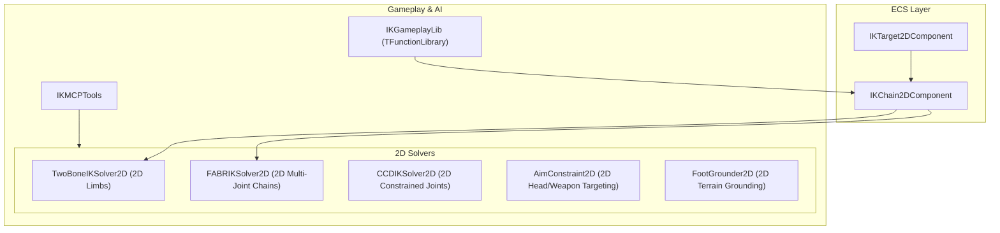

# 2D IKPlugin Architecture

The `IKPlugin` provides high-performance, purely mathematical 2D Inverse Kinematics (IK) solvers, constraint systems, and procedural foot grounding adaptation for TimeEngine.

---

## 🏛️ Ecosystem Overview

---

## 🔑 Key Subsystems

1. **`TwoBoneIKSolver2D`**: Exact analytical law-of-cosines 2-joint limb solver for character knees, elbows, and arms in 2D.
2. **`FABRIKSolver2D`**: Forward And Backward Reaching Inverse Kinematics for arbitrary length 2D chains (tails, spines, ropes, tentacles).
3. **`CCDIKSolver2D`**: Cyclic Coordinate Descent solver with per-joint angular clamping in 2D.
4. **`AimConstraint2D`**: Look-at solver directing 2D heads, eyes, and weapons toward target mouse / world coordinates.
5. **`FootGrounder2D`**: Procedural foot placement and pelvis adjustment based on raycast ground contact in 2D.
6. **`IKGameplayLib`**: Stateless gameplay helpers deriving from `TFunctionLibrary`.
7. **`IKMCPTools`**: Preprocessor-guarded AI automation tools for posing and 2D IK solver execution.
