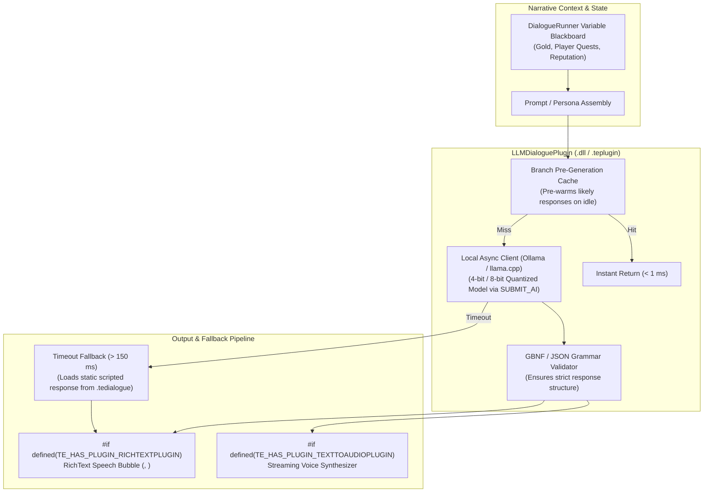

# LLMDialoguePlugin Architecture

The `LLMDialoguePlugin` provides a low-latency, production-ready on-device Large Language Model dialogue generator for dynamic NPC interaction.

---

## 🏛️ System Architecture: Production Reliability & Low Latency

---

## 🛠️ Contributor Implementation Guide

- Implement async socket polling to `localhost:11434` (Ollama) or embedded `llama.cpp` bindings in `src/LLMDialogueClient.cpp`.
- Enforce JSON / GBNF schema parsing in `src/Grammar/GBNFValidator.cpp`.
- Deliver generated tokens off the main thread via `SUBMIT_AI`.
