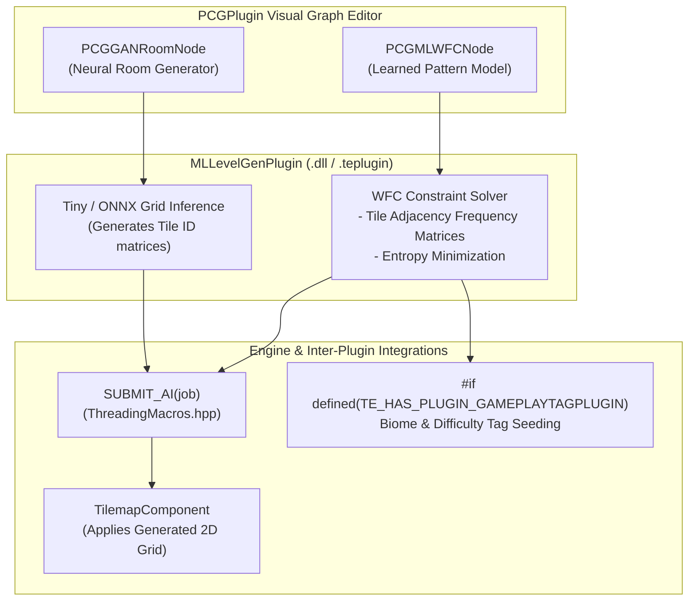

# MLLevelGenPlugin Architecture

The `MLLevelGenPlugin` integrates machine learning algorithms (such as Wave Function Collapse pattern synthesis and neural level generator models) into TimeEngine's procedural generation ecosystem.

---

## 🏛️ System Architecture Flowchart

---

## 🛠️ Contributor Implementation Guide

- Implement constraint propagation in `src/Nodes/PCGMLWFCNode.cpp`.
- Connect `#if defined(TE_HAS_PLUGIN_PCGPLUGIN)` to register nodes into the PCG node palette.
- Run tilemap generation tasks on `SUBMIT_AI` background worker threads.
