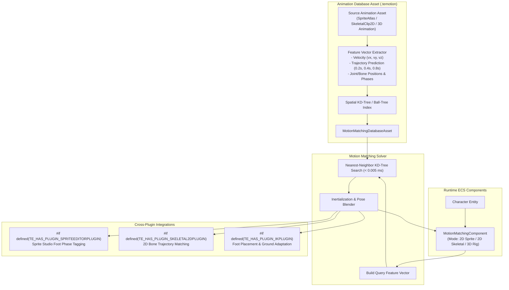

# MotionMatchingPlugin Architecture

The `MotionMatchingPlugin` provides a unified **Motion Matching** animation synthesis engine designed for **2D Sprite Flipbooks**, **2D Deformable Skeletal Rigs**, and extensible to **3D Skeletal Animation**.

---

## 🏛️ System Architecture Flowchart

---

## 📐 Unified Motion Matching Cost Function

The query cost function evaluates both the physical trajectory and joint/pose features across dimensions:
$$\text{Cost} = w_v \|\mathbf{v}_{\text{query}} - \mathbf{v}_{\text{frame}}\|^2 + w_t \sum_{i=1}^{K} \|\mathbf{p}_{\text{future}, i} - \mathbf{p}_{\text{frame}, i}\|^2 + w_\theta |\Delta \theta| + w_p (\text{PhaseMatch}) + w_j \sum_{j} \|\mathbf{x}_{\text{joint}, j}^{\text{query}} - \mathbf{x}_{\text{joint}, j}^{\text{frame}}\|^2$$

---

## 🛠️ Contributor Implementation Guide

- Extend `MotionMatchingComponent` to handle 2D sprite frames, 2D skeletal rigs, and future 3D meshes.
- Implement spatial search queries in `src/MotionMatchingDatabase.cpp`.
- Connect `#if defined(TE_HAS_PLUGIN_IKPLUGIN)` for post-search foot adjustment.
