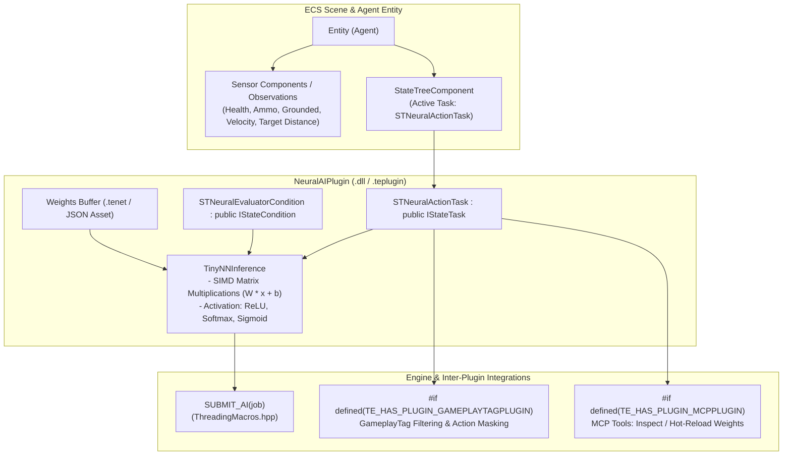

# NeuralAIPlugin Architecture

The `NeuralAIPlugin` provides an embedded, zero-dependency micro neural network inference engine and native **StateTree** tasks and conditions for TimeEngine.

---

## 🏛️ System Architecture Flowchart

---

## 🔑 Key Components & Responsibilities

1. **`TinyNNInference`**:
   - Lightweight, header-only forward-pass inference engine (2-3 dense layers).
   - Designed with zero third-party ML runtime overhead (pure C++ with AVX2/SSE/NEON acceleration).
   - Operates on normalized observation vectors: $\mathbf{x} \in [-1.0, 1.0]^N$.

2. **`STNeuralActionTask` (`IStateTask`)**:
   - Collects ECS observations upon tick.
   - Evaluates action probability distribution: `[Patrol, Engage, Retreat, SeekCover]`.
   - Selects argmax/sample action and transitions agent state.

3. **`STNeuralEvaluatorCondition` (`IStateCondition`)**:
   - Asserts whether the neural model's confidence for a specific behavior exceeds a configured threshold.

4. **Cross-Plugin Preprocessor Integration**:
   - `#if defined(TE_HAS_PLUGIN_GAMEPLAYTAGPLUGIN)`: Masks prohibited action indices based on active `GameplayTag` containers (e.g. Disarmed, Stunned).
   - `#if defined(TE_HAS_PLUGIN_MCPPLUGIN)`: Exposes neural network introspection and live weight hot-reloading tools over the Model Context Protocol.

---

## 🛠️ Contributor Implementation Guide

- Fill in matrix multiplication in `src/TinyNNInference.cpp`.
- Implement `STNeuralActionTask::TickState()` to pull components via `Entity` and trigger inference via `SUBMIT_AI`.
