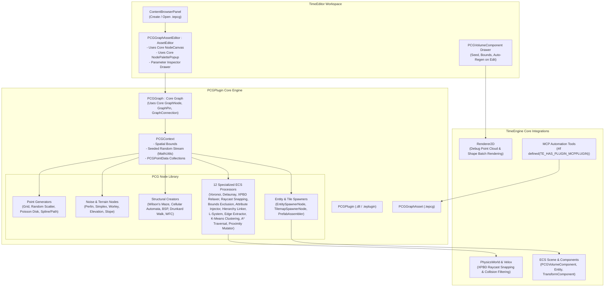

# PCGPlugin Architecture

The `PCGPlugin` provides a high-performance 2D/3D Procedural Content Generation (PCG) toolset, node execution graph engine, ECS volume component, and visual asset editor for TimeEngine.

---

## 🏛️ System Architecture Flowchart

---

## 🔑 Key Features & Subsystems

1. **Leverages TimeEngine Core Graph**:
   - Extends native `Graph`, `GraphNode`, `GraphPin`, and `GraphConnection`.
   - Uses `NodeCanvas` and `NodePalettePopup` for full visual authoring, zoom/pan, and cable routing.

2. **Rich Procedural Node Suite**:
   - **Point Generators**: Grid, Random Scatter, Poisson Disk (Bridson's algorithm), and Spline Paths.
   - **Noise & Terrain**: Perlin, Simplex, Worley (Cellular), and Slope/Elevation map filters.
   - **Structural Solvers**: Wilson's uniform spanning tree maze, Cellular Automata cave carver, BSP rooms, Drunkard's Walk, and 2D Wave Function Collapse (WFC).
   - **12 Specialized ECS Processors**: Voronoi partitioning, Delaunay triangulation, XPBD physics point relaxation, Raycast collision snapping, Bounds exclusion masking, ECS attribute injection, Prefab hierarchy linking, L-System branching, Perimeter edge extraction, K-Means density clustering, A* pathfinding traversal, and Component proximity mutation.

3. **ECS Volume Component (`PCGVolumeComponent`)**:
   - Attachable to any entity in the scene to drive procedural generation with custom volume bounds, seeds, and runtime/editor regeneration triggers.

4. **Self-Contained MCP Tools**:
   - Automated AI graph generation and execution over the Model Context Protocol bridge.
