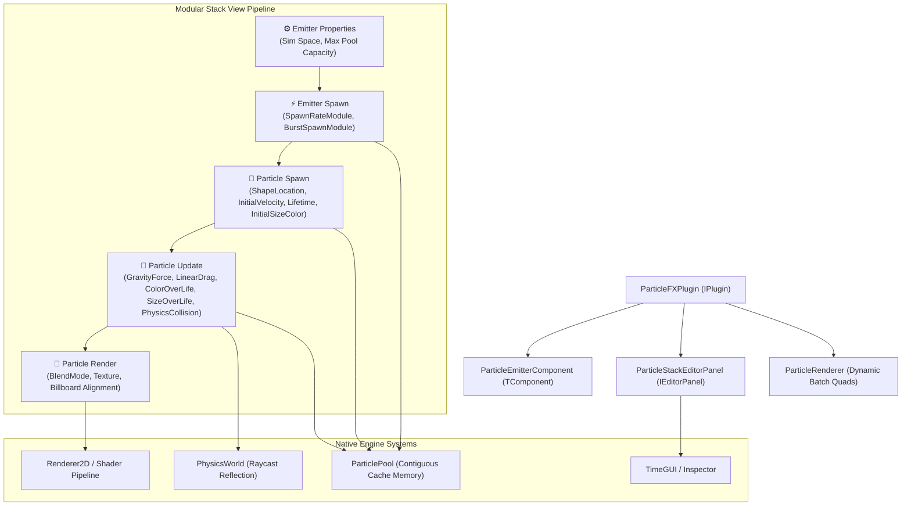

# ParticleFXPlugin Architecture

`ParticleFXPlugin` is an extensible, high-performance 2D/3D particle simulation and visual effects plugin for TimeEngine.

> [!NOTE]
> **ParticleFXPlugin** provides a modular, data-driven particle architecture structured around a **Modular Stack View** (Emitter Properties, Emitter Spawn, Particle Spawn, Particle Update, Particle Render). It is 100% native, runs on CPU/GPU with cache-friendly contiguous memory pools, supports real-time 2D/3D physics world collision raycasting, and includes built-in one-click presets for common game visual effects.

---

## 🏛️ Subsystem Architecture



---

## 📂 Directory Layout

```
Engine/Plugins/ParticleFXPlugin/
├── ParticleFXPlugin.teplugin               # Standalone manifest descriptor (Enabled: true)
├── ARCHITECTURE.md                         # Deep architectural documentation
└── src/
    ├── ParticleFXPlugin.hpp/.cpp           # IPlugin entry point & registration
    ├── Components/
    │   ├── ParticleEmitterComponent.hpp    # ECS component with reflection & presets
    │   └── ParticleEmitterComponent.cpp    # Module orchestration & preset definitions
    ├── Core/
    │   ├── ParticleTypes.hpp               # Particle, ColorGradient, FloatCurve, Shapes
    │   ├── ParticlePool.hpp                # Memory pool (contiguous vector, fast recycling)
    │   ├── ParticleSpawner.hpp             # Emitter Spawn & Particle Spawn coordinator
    │   ├── ParticleUpdater.hpp             # Particle Update & physics bounce coordinator
    │   └── Modules/
    │       ├── ParticleModule.hpp          # Base class for stack modules
    │       ├── SpawnModules.hpp            # Rate, Burst, Shape Location, Velocity, Lifetime
    │       └── UpdateModules.hpp           # Gravity, Drag, Color Gradient, Size Curve, Physics Collision
    ├── Editor/
    │   ├── ParticleStackEditorPanel.hpp/.cpp # Modular Stack View editor workspace
    │   └── ParticleWidgets.hpp             # Custom header cards & gradient widgets
    ├── Gameplay/
    │   ├── ParticleSystemGameplayLib.hpp   # TFunctionLibrary child (stateless gameplay APIs)
    │   └── ParticleSystemGameplayLib.cpp   # Spawning, bursts, hit impacts, explosion FX
    └── Rendering/
        ├── ParticleRenderer.hpp/.cpp       # Dynamic batch quad & point renderer
        └── ParticleShaders.hpp             # Built-in vertex/fragment shaders (Additive & Alpha)
```

---

## 🎮 Decentralized Gameplay Library (`ParticleSystemGameplayLib`)

`ParticleSystemGameplayLib` is a stateless gameplay action library deriving from **`TFunctionLibrary`**, enabling gameplay programmers and scripting systems to spawn and control particle effects across scenes with a single line of code:

### 1. Spawning & Emitter Lifecycle
```cpp
// Spawn a fire emitter at world coordinates
Entity fireEntity = ParticleSystemGameplayLib::SpawnEmitterAtLocation(entityManager, TEVector(5.0f, 2.0f, 0.0f), "Fire");

// Attach an engine trail to a moving spaceship entity
Entity trail = ParticleSystemGameplayLib::SpawnEmitterAttached(entityManager, shipEntity, TEVector(0.0f, -1.0f, 0.0f), "Sparks");
```

### 2. Hit Impacts & Combat FX
```cpp
// Spawn bouncing hit sparks on projectile collision
ParticleSystemGameplayLib::SpawnHitImpactSparks(entityManager, hitPoint, hitNormal, 35, TEColor(1.0f, 0.9f, 0.4f, 1.0f));

// Spawn an instant explosion
ParticleSystemGameplayLib::SpawnExplosion(entityManager, explosionPos, 120, 10.0f);

// Spawn a smoke puff on landing
ParticleSystemGameplayLib::SpawnSmokePuff(entityManager, landingPos, 1.2f, 2.5f);
```

### 3. Control & Bursts
```cpp
// Trigger instantaneous burst on an existing emitter
ParticleSystemGameplayLib::TriggerBurst(entityManager, emitterEntity, 50);

// Pause or Resume
ParticleSystemGameplayLib::SetEmitterActive(entityManager, emitterEntity, true);

// Clean up emitter
ParticleSystemGameplayLib::StopAndDestroyEmitter(entityManager, emitterEntity);
```

---

## 🥞 Modular Stack View Specification

Each emitter is evaluated through a clear sequence of modular stages:

1. **Emitter Properties**:
   - `Simulation Space`: `World` (particles stay in world coordinates when emitter moves) or `Local` (particles move relative to entity transform).
   - `Max Capacity`: Dynamically resizes contiguous particle pool.

2. **Emitter Spawn**:
   - `SpawnRateModule`: Accumulator-based continuous emission rate ($N$ particles/sec).
   - `BurstSpawnModule`: Instantaneous bursts of particles with repeat interval, delay, and cycle limits.

3. **Particle Spawn**:
   - `ShapeLocationModule`: Calculates initial spawn offsets across shapes (`Point`, `Circle2D`, `Box2D`, `Cone2D`, `Sphere3D`, `Box3D`).
   - `InitialVelocityModule`: Adds velocity along base direction with spread angle randomness and speed min/max ranges.
   - `InitialLifetimeModule`: Assigns lifetime within configured min/max range.
   - `InitialSizeColorModule`: Sets starting particle size, base tint, rotation, and angular velocity.

4. **Particle Update**:
   - `GravityForceModule`: Applies directional acceleration ($g \cdot \Delta t$).
   - `LinearDragModule`: Damps velocity smoothly over time.
   - `ColorOverLifeModule`: Evaluates multi-stop color and alpha gradient ramps over normalized age.
   - `SizeOverLifeModule`: Scales size along curve / easing functions over life.
   - `PhysicsCollisionModule`: Performs `PhysicsWorld::Raycast()` against scene colliders, calculates surface reflection angle, and applies bounciness and friction coefficients.

5. **Particle Render**:
   - `Blend Mode`: Selectable `Alpha Blend`, `Additive`, `Multiply`, `Opaque`.
   - `Texture`: Binds sprite textures or falls back to procedural soft circular falloff.

---

## 🎆 Built-in FX Presets

`ParticleEmitterComponent` provides one-click factory presets:
- **🔥 Fire**: Upward rising buoyant particles with short lifetime, additive blending, and high spawn rate.
- **✨ Sparks**: Fast bursts with wide spread angle, gravity pull, physics collision bouncing, and additive glow.
- **💥 Explosion**: High instantaneous burst, radial 360-degree spread, linear drag, and fading smoke transition.
- **💨 Smoke**: Slow rising particles with long lifetime, alpha blending, and expanding size curve.
- **🌧️ Rain**: Wide top-box emission, high downward velocity, tight spread, and ground bounce splash.
