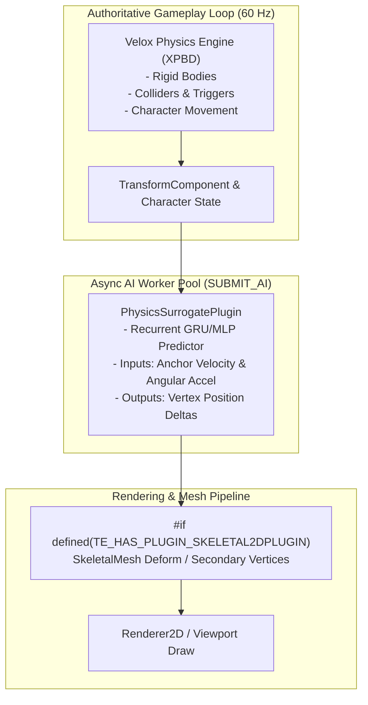

# PhysicsSurrogatePlugin Architecture

The `PhysicsSurrogatePlugin` provides a pre-trained machine learning surrogate model for high-performance visual secondary motion (such as 2D cloth/cape fluttering, hair dynamics, rope, and soft-body slimes).

---

## 🏛️ System Architecture: Velox vs ML Surrogate

> [!IMPORTANT]
> - **Velox Physics Engine**: TimeEngine's authoritative deterministic Extended Position-Based Dynamics (XPBD) solver. Handles all gameplay-critical collisions, rigid-body movement, character grounding, and raycast hits.
> - **PhysicsSurrogatePlugin**: An **exclusive visual secondary-motion accelerator**. Predicts multi-vertex deformation offsets in a single forward pass without placing iterative constraint loads on the physics thread.

---

## 🛠️ Contributor Implementation Guide

- Implement `SurrogatePredictor::PredictDisplacements()` to evaluate recurrent network weights.
- Submit secondary motion inference jobs to `SUBMIT_AI(job)` to avoid blocking the main or physics thread.
- Inject output displacements directly into mesh deform buffers.
