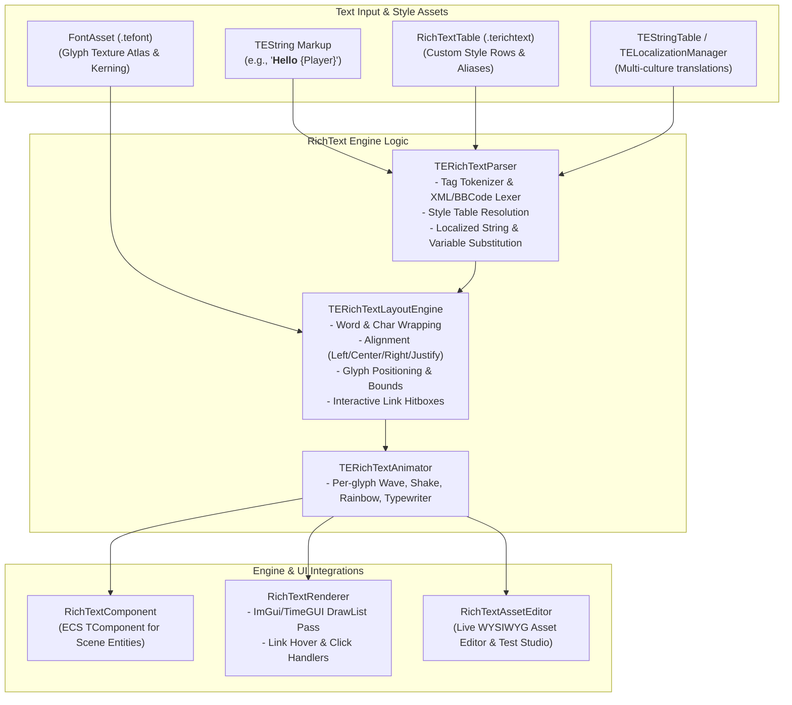

# RichTextPlugin Architecture

The `RichTextPlugin` module provides a standalone, dynamic rich text system for TimeEngine, featuring BBCode/XML markup parsing, `RichTextTable` style sheets (derived from `TEDataTable`), `stb_truetype` font metric integration, real-time vertex animations, and interactive hyperlink hit testing.

> [!NOTE]
> Powered by TimeEngine's unified [`TEString`](../../Include/Utils/TEString.hpp), the plugin supports dynamic culture-aware localization via `TEString::ResolveLocalized()` (`TELocalizationManager` / `TEStringTable`) and dynamic variable substitution via `TEString::FormatText()`.

---

## 🏛️ Rich Text Subsystem Flowchart

---

## Supported Tags & Markup Syntax

| Tag | Example | Description |
|---|---|---|
| `<b>` | `<b>Bold Text</b>` | Bold weight style flag |
| `<i>` | `<i>Italic Text</i>` | Italic slope style flag |
| `<u>` | `<u>Underlined</u>` | Bottom baseline underline stroke |
| `<s>` | `<s>Strikethrough</s>` | Center horizontal strike stroke |
| `<color>` | `<color=#FFD700>`, `<color=gold>`, `<color=rgba(255,0,0,255)>` | Text color override |
| `<size>` / `<scale>` | `<size=24>`, `<scale=1.5>` | Custom font size or relative scale |
| `<align>` | `<align=center>...</align>` | Paragraph alignment (`left`, `center`, `right`, `justify`) |
| `<link>` | `<link=OpenShop>Visit Shop</link>` | Interactive clickable hyperlink with mouse hover/click callbacks |
| `<icon>` / `<sprite>` | `<icon="Coin">`, `<sprite="Atlas:Item">` | Inline sprite or texture quad |
| `<wave>` | `<wave amp=4 speed=3>Wavy text</wave>` | Sinusoidal vertical displacement per character |
| `<shake>` | `<shake intensity=2 speed=10>Shaking text</shake>` | Jittery vertex offset noise |
| `<rainbow>` | `<rainbow speed=2>Rainbow text</rainbow>` | Real-time HSL color cycling |
| `<typewriter>` | `<typewriter speed=20>Revealing text</typewriter>` | Progressive character-by-character reveal |
| `<style>` / `<CustomTag>` | `<style="Header">` or `<Header>Title</Header>` | Resolves presets defined in `RichTextTable` |

---

## Asset & Table Ecosystem

1. **`RichTextDataAsset` (`public DataAsset`)**:
   - Universal data asset holding rich text style attributes (Font, Size, Color, Gradient, Bold, Italic, Underline, Effect, EffectParams).
2. **`RichTextTable` (`public TEDataTable`)**:
   - Specialized tabular database of `RichTextDataAsset` rows saved in TimeEngine Native Text format (`.terichtext`).
3. **`RichTextComponent` (`public TComponent`)**:
   - Scene entity component rendering rich text with word-wrapping, styles, and animation ticks.
4. **`RichTextPreviewPanel` (`public IEditorPanel`)**:
   - Live WYSIWYG studio for testing markup, interactive links, and real-time vertex animators.
