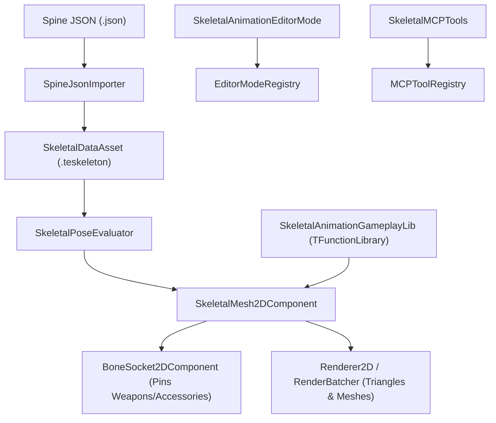

# Skeletal2DPlugin Architecture

The `Skeletal2DPlugin` delivers native 2D skeletal character animation, weight-based deformable skinning, bone sockets, Spine JSON import interoperability, an interactive rigging editor mode (`SkeletalAnimationEditorMode`), and MCP tools.

---

## 🏛️ Ecosystem Overview

---

## 🔑 Key Subsystems

1. **`BoneHierarchy` & `SkeletalPoseEvaluator`**: Pure native forward kinematics bone tree with rest poses, inverse bind matrices, and timeline track evaluation.
2. **`SkeletalMesh2DComponent`**: ECS component with multi-track blending, cross-fading, skin swapping, and batch renderer submission.
3. **`BoneSocket2DComponent`**: Pins child entities to arbitrary animated bones with translation and rotation offsets.
4. **`SpineJsonImporter`**: Importer parsing external Spine JSON structures into native `.teskeleton` assets with zero third-party library dependencies.
5. **`SkeletalAnimationGameplayLib`**: Stateless gameplay scripting helpers inheriting from `TFunctionLibrary`.
6. **`SkeletalAnimationEditorMode`**: Visual authoring mode registered dynamically in `EditorModeRegistry`. Implements `ShouldHideStandardPanels() = true` and `WantsFullscreenWorkspace() = true` to occupy a dedicated full-window workspace `"Skeletal Rig Studio"`.
7. **`SkeletalAssetEditor`**: Decentralized tabbed asset editor registered in `AssetEditorRegistry` for `.teskeleton` and `.tespine` files.
8. **`SkeletalMCPTools`**: Preprocessor-guarded Model Context Protocol tools for AI-driven skeleton creation and Spine importation.
