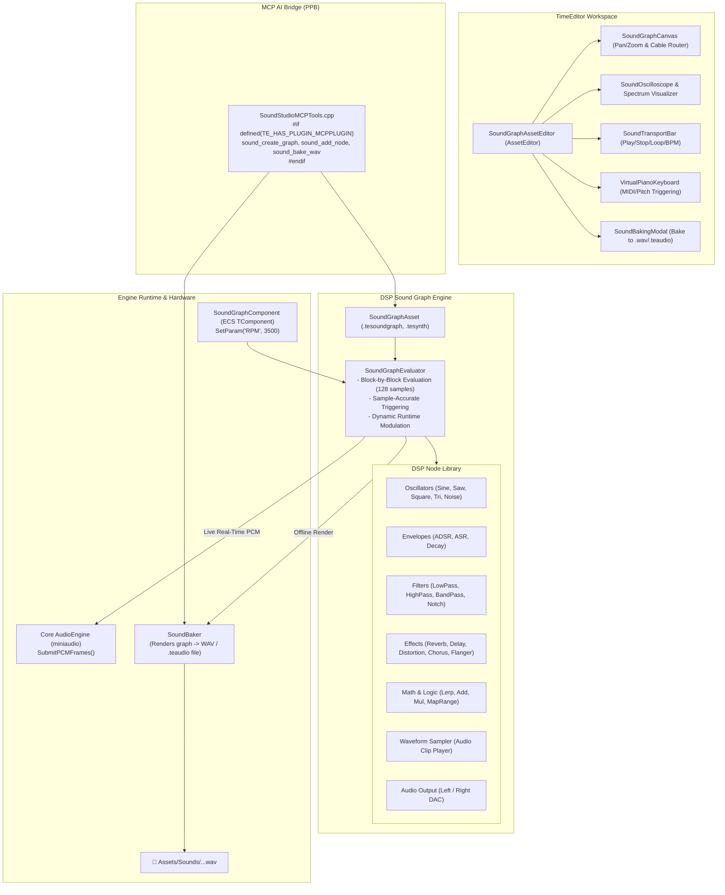

# SoundSynthesizerPlugin Architecture

The `SoundSynthesizerPlugin` provides a procedural audio synthesis, sound design, DSP graph execution, and offline audio baking ecosystem for TimeEngine.

---

## 🏛️ System Architecture Flowchart

---

## 🔑 Key Features & Subsystems

1. **Interactive Sound Graph (`SoundGraph`)**:
   - Sample-accurate execution of modular audio DSP nodes.
   - Signal rate (44.1kHz audio buffers) and Control rate (trigger pulses, floats) pin connections.

2. **Real-time Procedural Audio Streaming**:
   - Zero-latency DSP evaluation block streaming directly to `AudioEngine::SubmitPCMFrames()`.

3. **1-Click Sound Baking (`SoundBaker`)**:
   - Offline multi-rate WAV rasterizer (16-bit, 24-bit, 32-bit float).

4. **Dedicated Sound Graph Asset Editor (`SoundGraphAssetEditor`)**:
   - Decentralized registered `AssetEditor` with interactive canvas, real-time waveform oscilloscope, frequency spectrum visualizer, and virtual piano keyboard.

5. **Self-Contained MCP Tools (PPB)**:
   - Automated AI sound patch creation and audio baking over MCP.
