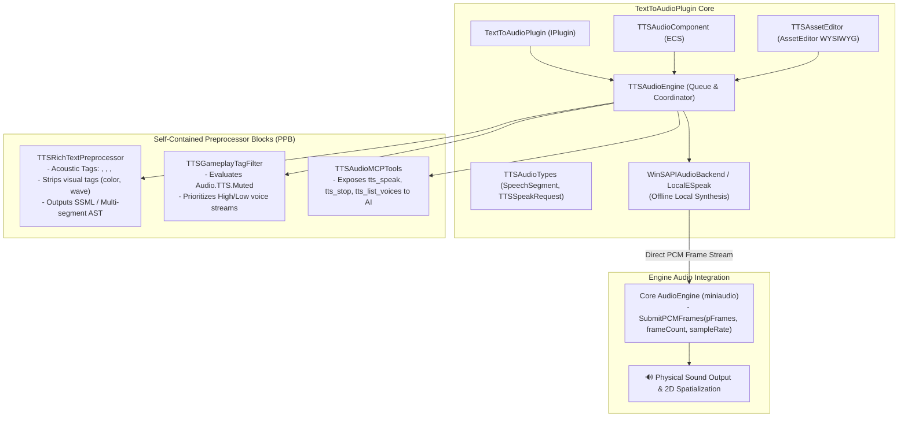

# TextToAudioPlugin Architecture

The `TextToAudioPlugin` provides offline, high-performance Text-to-Audio and Speech Synthesis for TimeEngine entities, dialogues, narrative systems, and editor tooling.

---

## 🏛️ Plugin Architecture Flowchart

---

## 🔑 Key Features & Subsystems

1. **100% Local & Offline**:
   - Uses native local speech synthesis APIs (`sapi.h` on Windows, local speech engines on other platforms) to produce pure PCM memory streams.
   - Requires zero external cloud connections or API keys.

2. **Core AudioEngine Integration**:
   - Synthesized PCM is directly routed to `AudioEngine::SubmitPCMFrames()`.
   - Allows synthesized voices to naturally participate in master mixer volumes, time dilation pitch modulation, and 2D spatial positioning.

3. **Synchronous & Asynchronous Dual Playback**:
   - `TTSSpeakMode::Async`: Enqueues to worker thread queue for gameplay and responsive dialogue.
   - `TTSSpeakMode::Sync`: Blocks execution until audio is fully synthesized and played (ideal for offline cutscenes, render tests, and scripts).

4. **Acoustic Rich Text Voice Modulation**:
   - Interprets expressive markup tags (`<pause time="500ms"/>`, `<pitch value="+20%">`, `<rate value="1.2">`, `<accent value="en-GB">`, `<emphasis level="strong">`, `<whisper>`) into native SSML or segmented speech data.
   - Automatically sanitizes and removes visual-only rich text tags (`<b>`, `<i>`, `<color>`, `<wave>`, `<rainbow>`).

5. **Self-Contained Preprocessor Blocks**:
   - All optional integrations (RichText, GameplayTags, MCP) are guarded locally with Premake-generated `TE_HAS_PLUGIN_*` defines inside this plugin without touching core or external plugins.
