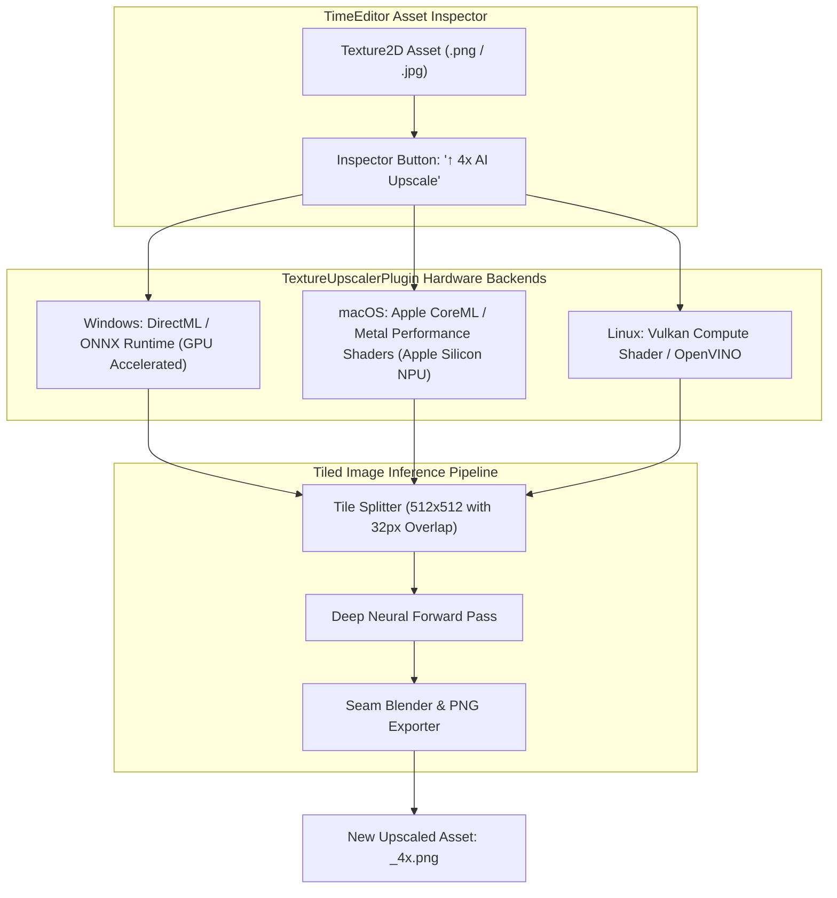

# TextureUpscalerPlugin Architecture

The `TextureUpscalerPlugin` provides deep-learning-based 2D asset super-resolution (ESRGAN / Real-ESRGAN / SRGAN) inside **TimeEditor** with cross-platform hardware acceleration.

---

## 🏛️ System Architecture Flowchart

---

## 🛠️ Contributor Implementation Guide

- Implement `TextureUpscalerBackend` dispatchers for Windows (DirectML), macOS (Metal/CoreML), and Linux (Vulkan).
- Implement tiled inference with overlap blending to maintain low VRAM footprint ($< 500\text{ MB}$).
- Connect `#if defined(TE_HAS_PLUGIN_SPRITEEDITORPLUGIN)` to add upscale actions to Sprite Studio.
