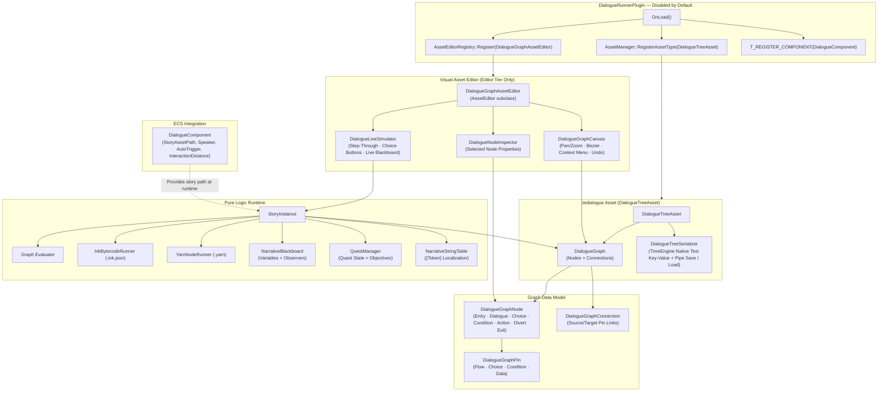

# DialogueRunnerPlugin Architecture

## Overview

`DialogueRunnerPlugin` is an optional, decoupled TimeEngine plugin providing:
- **Native Visual Graph Asset Editor** for `.tedialogue` assets with node-graph canvas, bezier splines, inspector, and live in-editor story simulation.
- **Pure Logic Runtime Runner** for `.tedialogue` graphs, compiled Ink JSON (`.ink.json`), and Yarn (`.yarn`) formats.
- **Variable Blackboard** with observer callbacks for reactive game state.
- **Quest State Machine** tracking quest status and objectives.
- **Localization String Table** with `{token}` substitution.
- **`DialogueComponent`** ECS component for entity-level story binding.

> **Disabled by default.** Set `Enabled: true` in `DialogueRunnerPlugin.teplugin` to activate.

---

## Plugin Boundary

| Allowed | Forbidden |
|---|---|
| Pure logic: story AST, blackboard, quest state | OpenGL / Vulkan / Renderer API calls |
| ImGui for editor-tier asset editor only | Velox physics / collision queries |
| `AssetManager` and `AssetEditorRegistry` | Direct GPU resource allocation |
| `TComponent` ECS data registration | Audio playback |

---

## Architecture Diagram



---

## File Structure

```
DialogueRunnerPlugin/
├── DialogueRunnerPlugin.teplugin     # Manifest (Enabled: false)
├── ARCHITECTURE.md
└── src/
    ├── DialogueRunnerPlugin.hpp/.cpp  # IPlugin entry & registration
    ├── NarrativeTypes.hpp             # Enums: NodeType, QuestStatus, Comparison, Mutation
    ├── Asset/
    │   ├── DialogueTreeAsset.hpp/.cpp         # Asset subclass (.tedialogue)
    │   └── DialogueTreeSerializer.hpp/.cpp    # JSON graph serializer
    ├── Graph/
    │   ├── DialogueGraphPin.hpp               # Input/Output pin model
    │   ├── DialogueGraphNode.hpp              # Full node data model
    │   ├── DialogueGraphConnection.hpp        # Node link model
    │   └── DialogueGraph.hpp/.cpp             # Graph container, node/connection management
    ├── Editor/
    │   ├── DialogueGraphAssetEditor.hpp/.cpp  # AssetEditor subclass (tab handler)
    │   ├── DialogueGraphCanvas.hpp/.cpp       # ImDrawList node graph canvas
    │   ├── DialogueNodeInspector.hpp/.cpp     # Selected node property editor
    │   └── DialogueLiveSimulator.hpp/.cpp     # In-editor story step-through simulator
    ├── Runtime/
    │   ├── NarrativeValue.hpp/.cpp            # Variant value (bool/int/float/string)
    │   ├── NarrativeBlackboard.hpp/.cpp       # Variable store + observers
    │   ├── QuestManager.hpp/.cpp              # Quest state machine
    │   ├── StoryInstance.hpp/.cpp             # Runtime story session controller
    │   └── Localization/
    │       └── NarrativeStringTable.hpp/.cpp  # Localization dict + {token} formatter
    ├── Interpreters/
    │   ├── InkBytecodeRunner.hpp/.cpp         # Compiled Ink JSON interpreter
    │   └── YarnNodeRunner.hpp/.cpp            # Yarn dialogue format interpreter
    └── Components/
        └── DialogueComponent.hpp              # ECS TComponent for entity story binding
```

---

## Key Patterns

### Asset Registration (OnLoad)
```cpp
AssetManager::RegisterAssetType(CreateRef<DialogueTreeAsset>());
AssetEditorRegistry::Register(CreateRef<DialogueGraphAssetEditor>());
```

### External Function Binding
```cpp
story->BindFunction("GiveGold", [](const std::vector<NarrativeValue>& args) -> NarrativeValue {
    int amount = args[0].AsInt();
    // game logic here...
    return NarrativeValue(true);
});
```

### Blackboard & Observers
```cpp
story->GetBlackboard().AddObserver([](const std::string& name, const NarrativeValue& val) {
    // React to variable changes
});
story->GetBlackboard().ApplyMutation("gold_amount", MutationOp::Add, NarrativeValue(50));
```

### Save / Load Story State
```cpp
std::string saved = story->SaveStateJson();
story->LoadStateJson(saved); // Restore full session including visited nodes & variables
```
