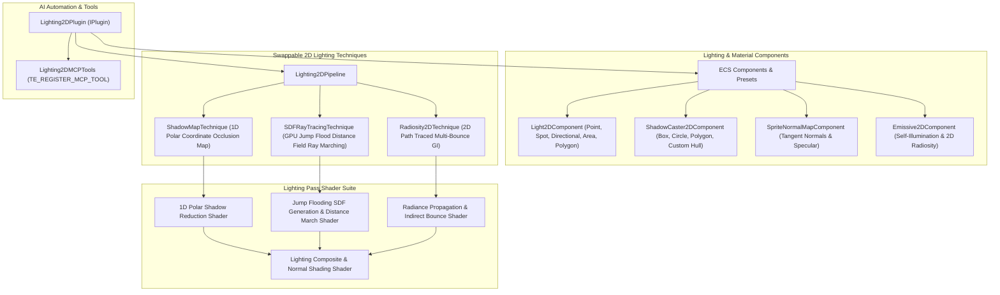

# Lighting2DPlugin Architecture

The `Lighting2DPlugin` is an industry-standard, high-performance 2D dynamic lighting, soft shadow casting, normal-mapped rendering, and 2D ray tracing / radiosity plugin for TimeEngine.

> [!NOTE]
> In short, **Lighting2DPlugin** transforms flat 2D sprite rendering into atmospheric, cinematic worlds (reminiscent of *Dead Cells*, *Hollow Knight*, *Noita*, and *The Siege and the Sandfox*). It provides multiple swappable lighting techniques—from lightweight 1D polar shadow mapping to GPU distance-field 2D ray tracing and multi-bounce radiosity—while remaining completely modular and optional.

---

## 🏛️ Subsystem Architecture



---

## 📂 Component Directory Breakdown

```
Engine/Plugins/Lighting2DPlugin/
├── Lighting2DPlugin.teplugin           # Standalone plugin manifest (Enabled: true)
├── ARCHITECTURE.md                  # Plugin architecture documentation
└── src/
    ├── Lighting2DPlugin.hpp/.cpp    # Plugin entry point (IPlugin lifecycle)
    ├── Core/
    │   ├── Lighting2DTypes.hpp       # Enums, structs (ELight2DType, ERenderTechnique, LightParams)
    │   ├── Lighting2DPipeline.hpp/.cpp # Main coordinator for 2D lighting render passes
    │   └── Lighting2DConfig.hpp      # Global settings (Ray steps, Shadow Map resolution, Bloom)
    ├── Components/
    │   ├── Light2DComponent.hpp/.cpp # Point, Spot, Directional, Polygon Light
    │   ├── ShadowCaster2DComponent.hpp/.cpp # Polygon/Box/Circle shadow caster geometry
    │   ├── SpriteNormalMapComponent.hpp/.cpp# Normal & specular material bindings
    │   └── Emissive2DComponent.hpp/.cpp   # Self-illuminated entities for 2D GI
    ├── Techniques/
    │   ├── ILightingTechnique.hpp    # Base interface for rendering strategies
    │   ├── ShadowMapTechnique.hpp/.cpp # 1D Polar Coordinate Shadow Mapping
    │   ├── SDFRayTracingTechnique.hpp/.cpp # 2D Distance Field (JFA) GPU Ray Marching
    │   └── Radiosity2DTechnique.hpp/.cpp   # 2D Path Tracing / Multi-bounce GI
    ├── Shaders/
    │   └── Lighting2DShaders.hpp/.cpp# Embedded GLSL shaders for all passes
    ├── Editor/
    │   ├── Light2DGizmoDrawer.hpp/.cpp # In-editor visualizers for radius, cones, polygons
    │   └── Lighting2DSettingsPanel.hpp/.cpp # Quality settings in Editor window
    └── MCP/
        └── Lighting2DMCPTools.cpp    # Declarative macro-based AI tools (TE_REGISTER_MCP_TOOL)
```

---

## 💡 Key Subsystems & Techniques

### 1. 1D Polar Shadow Mapping (`ShadowMapTechnique`)
* **Role**: Ultra-high-speed shadow mapping designed for mobile devices, integrated GPUs, and high framerate action titles.
* **Mechanism**:
  1. Renders shadow caster geometry into a square occlusion mask.
  2. Reduces occlusion into a 1D polar angle depth buffer ($N \times 1$ texture).
  3. Projects light quad with Percentage-Closer Filtering (PCF) for smooth, antialiased shadow penumbra.

### 2. 2D Distance-Field Ray Tracing (`SDFRayTracingTechnique`)
* **Role**: Software ray tracing running on GPU fragment/pixel shaders, requiring no specialized hardware RT cores (runs on standard OpenGL 3.3+ / DirectX 11 / Vulkan / WebGL).
* **Mechanism**:
  1. Encodes solid obstacle outlines into a 1-bit scene mask.
  2. Computes the Exact Euclidean Distance Field using the **Jump Flooding Algorithm (JFA)** in $O(\log_2 N)$ screen passes.
  3. Ray marches through the 2D Signed Distance Field (SDF) toward each light source.
  4. Produces physically accurate **contact hardening** (sharp shadows near feet/bases, smoothly dissolving penumbra at distance).

### 3. 2D Path Tracing & Radiosity (`Radiosity2DTechnique`)
* **Role**: Global Illumination (GI), color bleeding, and indirect bounce lighting.
* **Mechanism**:
  1. Evaluates direct light and surface albedo.
  2. Emits secondary radiance rays from illuminated surfaces and `Emissive2DComponent` objects.
  3. Ping-pongs radiance textures across 1–3 blur/bounce passes to simulate ambient indirect illumination.

### 4. Normal & Specular Shading (`SpriteNormalMapComponent`)
* Applies 2D tangent/world-space surface normal maps and specular roughness maps to sprites, turning flat 2D pixel art into responsive 3D-lit surfaces when point/spot/directional lights move across the screen.

---

## 🤖 MCP AI Automation Tools

The plugin registers the following declarative MCP tools via `TE_REGISTER_MCP_TOOL`:
- `spawn_2d_light`: Spawns and configures a Point, Spot, Directional, or Area 2D light in the active scene.
- `set_lighting_technique`: Switches the active technique (`"ShadowMap"`, `"SDFRayTracing"`, `"Radiosity2D"`).
- `set_ambient_lighting`: Configures multi-color day/night ambient sky and horizon lighting.
- `attach_normal_map`: Attaches a normal map and specular roughness texture to a sprite entity.
