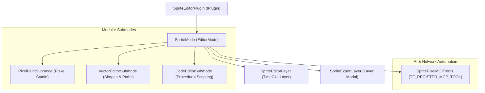

# SpriteEditorPlugin Architecture

The `SpriteEditorPlugin` is a standalone 2D sprite creation, pixel art studio, and vector path editing plugin for TimeEngine.

> [!NOTE]
> In short, **SpriteEditorPlugin** provides an in-engine creative studio for 2D game development without cluttering the core engine runtime. It features a Piskel-inspired multi-frame pixel art studio, bezier/polygonal vector shape tools, Godot-style procedural live code scripting, and headless/dialog PNG sprite sheet export pipelines.

---

## 🏛️ Subsystem Architecture



---

## 📂 Component Directory Breakdown

```
Engine/Plugins/SpriteEditorPlugin/
├── SpriteEditorPlugin.teplugin       # Standalone plugin manifest
├── ARCHITECTURE.md                  # Plugin architecture documentation
└── src/
    ├── SpriteEditorPlugin.hpp/.cpp   # Plugin entry point (IPlugin lifecycle)
    ├── SpriteEditorLayer.hpp/.cpp    # Standalone editor layer & toolbar
    ├── SpriteMode.hpp/.cpp           # State controller & undo/redo manager
    ├── SpriteEditorTypes.hpp         # PixelLayer, PixelFrame, and Vector structs
    ├── SpriteModeLibrary.hpp         # Procedural function definitions
    ├── Submodes/
    │   ├── ISubmode.hpp              # Base lifecycle interface for submodes
    │   ├── PixelPaintSubmode.hpp/.cpp# Piskel-style pixel art & animation studio
    │   ├── VectorEditorSubmode.hpp/.cpp # Vector shapes, anchors & boolean operations
    │   └── CodeEditorSubmode.hpp/.cpp# Procedural code editor & keyword inspector
    ├── Dialogs/
    │   └── SpriteExportLayer.hpp/.cpp# Standalone PNG & Spritesheet export layer
    └── MCP/
        └── SpritePixelMCPTools.cpp   # Declarative macro-based AI tools (TE_REGISTER_MCP_TOOL)
```

---

## 🎨 Key Subsystems & Features

### 1. Pixel Art Studio (`PixelPaintSubmode`)
* **Tool Palette**: 1–4px Pen, Vertical Mirror Symmetry Pen, Paint Bucket, Global Color Replace, Dithering Pen, Eraser, Line, Rect, Circle, and Color Picker.
* **Animation Strip**: Thumbnail frame cards, duplicate, delete, and Onion Skinning ghosting.
* **Live Animated Preview**: Real-time looping preview with 1–30 FPS slider.
* **Multi-Layer System**: Layer stack with opacity controls and visibility toggles (`👁️`).
* **Transform Operations**: Flip Horizontal/Vertical, Rotate 90° CW.
* **Canvas Resize Modal**: Aspect ratio preservation and crop vs expand grid anchor settings.

### 2. Export Pipeline (`SpriteExportLayer`)
* Inherits from `TE::Layer`.
* Supports both **Single Active Frame** export and multi-frame **Animation Spritesheet** generation (calculates optimal Column × Row grid).
* Directly rasterizes layered frames to 32-bit RGBA `.png` using `stb_image_write`.

### 3. AI & Automation Integration (`SpritePixelMCPTools`)
* Uses `TE_REGISTER_MCP_TOOL` to expose all pixel editing functions directly to external AI agents over JSON-RPC 2.0 without intermediate scripts.
