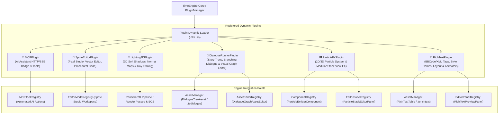

# Plugins Architecture

This directory contains optional and dynamic extensions (plugins) for TimeEngine.

> [!NOTE]
> In short, imagine TimeEngine as a high-tech gaming console. Instead of building every single feature directly into the main console hardware, the **Plugin System** acts as a "universal extension slot". Any new feature (like an AI bridge, custom editor tools, or networked controller) can be plugged in or unplugged without modifying or rebuilding the core console.

---

## Plugin Function Roles & Usage Guidelines

### 1. `OnLoad()`
- **When Used**: Called by the engine immediately after the dynamic library (`.dll`/`.so`) is loaded into memory.
- **What to do inside**: Spawn background threads, start HTTP/network servers (e.g. MCP server), register custom editor modes (`EditorModeRegistry`), or register custom MCP tools (`MCPToolRegistry`).
- **When NOT to use**: Do NOT perform heavy, blocking startup work directly on the main thread here if it delays engine startup.

```cpp
void SpriteEditorPlugin::OnLoad() {
    EditorModeRegistry::RegisterMode<SpriteMode>();
}
```

### 2. `OnUnload()`
- **When Used**: Called by the engine right before the dynamic library is detached or shut down.
- **What to do inside**: Gracefully unregister editor modes, close open socket handles, signal background threads to exit (`m_Running = false`), join threads, and free allocated memory.
- **When NOT to use**: Do NOT throw exceptions or block indefinitely inside `OnUnload()`.

```cpp
void SpriteEditorPlugin::OnUnload() {
    EditorModeRegistry::UnregisterMode("Sprite Mode");
}
```

### 3. Factory Exports (`CreatePluginInstance` & `DestroyPluginInstance`)
- **`CreatePluginInstance()`**: Called by the engine's plugin loader to instantiate the plugin on the heap.
- **`DestroyPluginInstance(plugin)`**: Called by the engine loader to safely delete the plugin instance using the plugin's own heap allocator.
- **Preferred Rule**: Always pair dynamic allocation with `DestroyPluginInstance` to prevent cross-DLL heap allocation crashes on Windows.

---

## 🏛️ Plugin Ecosystem Architecture



---

## Registered Plugins & Architectures

- 🤖 **[MCPPlugin Architecture](MCPPlugin/ARCHITECTURE.md)** — Model Context Protocol (MCP) HTTP/SSE Server Plugin & Macro-Based Tool Registry architecture documentation.
- 🏷️ **[GameplayTagPlugin Architecture](GameplayTagPlugin/ARCHITECTURE.md)** — Hierarchical Gameplay Tags Plugin architecture documentation.
- 🎨 **[SpriteEditorPlugin Architecture](SpriteEditorPlugin/ARCHITECTURE.md)** — Standalone 2D Sprite Studio plugin (Pixel Paint, Vector Shapes, Procedural Scripting, and Export Layer).
- 💡 **[Lighting2DPlugin Architecture](Lighting2DPlugin/ARCHITECTURE.md)** — 2D Dynamic Lighting, Soft Shadows, Normal Mapping & 2D Ray Tracing / Radiosity Plugin.
- 📜 **[DialogueRunnerPlugin Architecture](DialogueRunnerPlugin/ARCHITECTURE.md)** — Dialogue & Narrative Runner with Visual Graph Asset Editor, Ink/Yarn runtime support, Variable Blackboard, Quest Manager, and Localized String Substitution.
- 🎆 **[ParticleFXPlugin Architecture](ParticleFXPlugin/ARCHITECTURE.md)** — High-Performance 2D/3D Particle System & Modular Stack View FX Plugin with Physics Raycast Collision.
- 📝 **[RichTextPlugin Architecture](RichTextPlugin/ARCHITECTURE.md)** — Dynamic Rich Text Formatting, TEString Markup Parser, RichTextTable Style Sheets, Real-Time Vertex Animators, and TimeGUI/Renderer2D Integration.
- 🎛️ **[MaterialSystemPlugin Architecture](MaterialSystemPlugin/ARCHITECTURE.md)** — Modular Graph-Based Material and Physical Slab Layering Shading System Plugin.
- 🔊 **[TextToAudioPlugin Architecture](TextToAudioPlugin/ARCHITECTURE.md)** — Offline Text-to-Audio and Speech Synthesis Plugin with Acoustic RichText Tags, GameplayTags Gating, and MCP Remote AI Tools.
- 🎹 **[SoundSynthesizerPlugin Architecture](SoundSynthesizerPlugin/ARCHITECTURE.md)** — Procedural Audio Synthesis, DSP Node Graph, Sound Baking, and Audio Studio Workspace plugin.
- 🦴 **[Skeletal2DPlugin Architecture](Skeletal2DPlugin/ARCHITECTURE.md)** — Native 2D Skeletal Animation, Deformable Mesh Skinning, Spine JSON Import, Sockets, and Skeletal Rig Editor Mode.
- 🦾 **[IKPlugin Architecture](IKPlugin/ARCHITECTURE.md)** — High-Performance 2D & 3D Inverse Kinematics Solvers (2-Bone, FABRIK, CCD, Aim/LookAt, Foot Grounder).
- 🌲 **[PCGPlugin Architecture](PCGPlugin/ARCHITECTURE.md)** — 2D/3D Procedural Content Generation (PCG) Toolset, Point Data Collections, 12 Specialized ECS Processors, Structural Solvers, and Visual Graph Asset Editor.
- 🧠 **[NeuralAIPlugin Architecture](NeuralAIPlugin/ARCHITECTURE.md)** — Embedded Tiny Neural Network Inference, StateTree Tasks & Evaluators.
- 🏃 **[MotionMatchingPlugin Architecture](MotionMatchingPlugin/ARCHITECTURE.md)** — Unified 2D/3D Motion Matching, Trajectory Prediction, and Spatial KD-Tree Database.
- 🗺️ **[MLLevelGenPlugin Architecture](MLLevelGenPlugin/ARCHITECTURE.md)** — Wave Function Collapse (WFC) & Neural Grid Procedural Level Generation.
- 🎯 **[AdaptiveDifficultyPlugin Architecture](AdaptiveDifficultyPlugin/ARCHITECTURE.md)** — Dynamic Difficulty Adjustment (DDA) PID Controller & Player Telemetry.
- ⚡ **[PhysicsSurrogatePlugin Architecture](PhysicsSurrogatePlugin/ARCHITECTURE.md)** — ML-Accelerated Physics Surrogate Model for Visual Secondary Motion (Cloth/Cape/Hair).
- 🖼️ **[TextureUpscalerPlugin Architecture](TextureUpscalerPlugin/ARCHITECTURE.md)** — Cross-Platform 2D Texture Super-Resolution & 4x AI Upscaling.
- 💬 **[LLMDialoguePlugin Architecture](LLMDialoguePlugin/ARCHITECTURE.md)** — Production-Ready On-Device LLM Dialogue Engine & GBNF Grammar Constraints.
- 🎵 **[AdaptiveMusicPlugin Architecture](AdaptiveMusicPlugin/ARCHITECTURE.md)** — Dynamic Multi-Track Stem Crossfading & Interactive Audio Synthesis.
- 📊 **[AnalyticsHeatmapPlugin Architecture](AnalyticsHeatmapPlugin/ARCHITECTURE.md)** — Player Telemetry Recording, 2D Kernel Density Estimation (KDE) & Viewport Heatmap.
- 🛡️ **[CheatDetectionPlugin Architecture](CheatDetectionPlugin/ARCHITECTURE.md)** — Future Multiplayer Telemetry Validation & Anomaly Detection (Architectural Stub).

