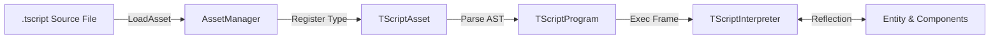

# TScript User Manual & Language Reference

Welcome to the official **TScript User Guide**. TScript is TimeEngine's native, zero-dependency, event-driven scripting language designed to combine C++ object orientation with Python's clean syntax.

---

## 🚀 Quickstart Example

Save your script as `PlayerController.tscript` under your project's `Assets/` directory:

```tscript
// PlayerController.tscript
class PlayerController : TComponent

    // Expose properties to Editor Inspector
    T_REGISTER_PROPERTY(float, speed, 350.0)
    T_REGISTER_PROPERTY(float, jump_force, 500.0)
    T_REGISTER_PROPERTY(bool, enable_jump, true)

    public:
        float health = 100.0

    private:
        float m_attack_cooldown = 0.0

    on_ready() {
        TE_CORE_INFO("Player spawned with speed: " + speed)
    }

    on_update(float dt) {
        transform.position.x += speed * dt

        if (transform.position.x > 800.0) {
            transform.position.x = -800.0
        }
    }

    on_collision(other) {
        TE_CORE_WARN("Collided with object: " + other)
    }
```

---

## 📐 Language Feature Guide

### 1. Unified Property Registration (`T_REGISTER_PROPERTY`)
To make a script variable editable in the TimeEditor Inspector window, register it with `T_REGISTER_PROPERTY`:

```tscript
T_REGISTER_PROPERTY(float, move_speed, 250.0)
T_REGISTER_PROPERTY(int, max_ammo, 30)
T_REGISTER_PROPERTY(bool, loop_animation, true)
T_REGISTER_PROPERTY(string, default_state, "Idle")
T_REGISTER_PROPERTY(TEVector2, spawn_point, {0.0, 0.0})
```

### 2. Region-Based Access Modifiers (`public:`, `private:`, `protected:`)
TScript uses C++ region-style access modifiers:

```tscript
public:
    float health = 100.0
    int score = 0

private:
    float m_internal_timer = 0.0
```

### 3. Lifecycle Events
TScript components automatically receive lifecycle callbacks:

| Event | Signature | Description |
|---|---|---|
| `on_ready` | `on_ready()` | Dispatched when the entity is instantiated in Play mode. |
| `on_update` | `on_update(float dt)` | Called every frame step with delta time in seconds. |
| `on_collision` | `on_collision(other)` | Dispatched on physics/collider overlap. |
| `on_input` | `on_input(bindings)` | Dispatched when input action events trigger. |
| `on_timer` | `on_timer(string name)` | Dispatched when a named timer expires. |
| `on_destroy` | `on_destroy()` | Dispatched when the entity is destroyed. |

### 4. Built-in Engine Functions

| Function | Signature | Description |
|---|---|---|
| `TE_CORE_INFO` | `TE_CORE_INFO(msg)` | Logs informative message to core log console. |
| `TE_CORE_WARN` | `TE_CORE_WARN(msg)` | Logs warning message. |
| `TE_CORE_ERROR` | `TE_CORE_ERROR(msg)` | Logs error message. |
| `min` / `max` | `min(a, b)` / `max(a, b)` | Returns min/max of two numbers. |
| `abs` / `sqrt` | `abs(x)` / `sqrt(x)` | Absolute value / square root. |
| `lerp` | `lerp(a, b, t)` | Linear interpolation between `a` and `b` by factor `t`. |

---

## ⚙️ Architecture & Data Flow



---

## 🏛️ Related Architecture & Internals

* ⚙️ **[TScript Subsystem Architecture](ARCHITECTURE.md)** — Architectural design, lexer/parser Pratt parsing specifications, AST node types, and time-rewind state preservation details.


