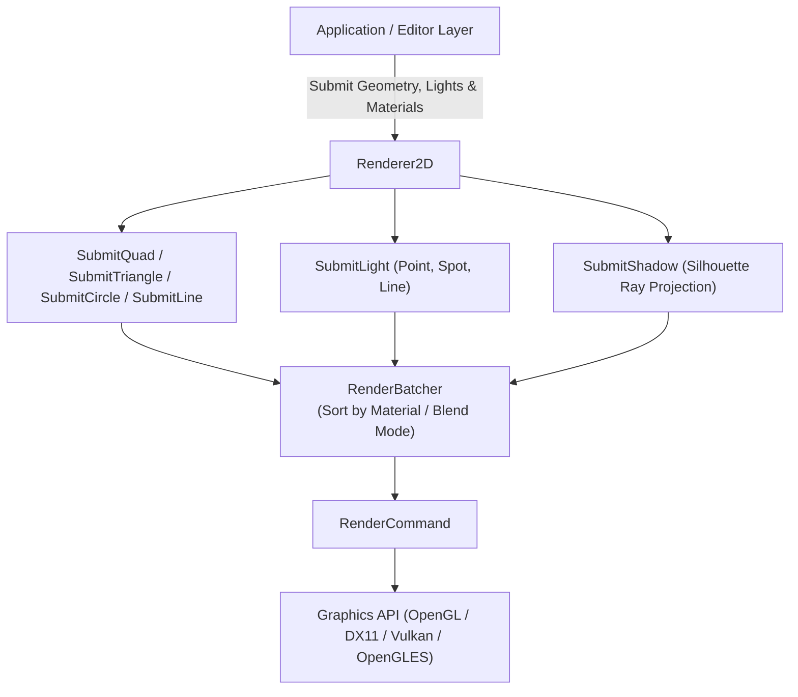

# Renderer Subsystem Architecture

The Renderer subsystem in TimeEngine provides multi-API graphics abstractions (OpenGL, DirectX 11, OpenGLES, Vulkan), high-performance batch rendering ([`Renderer2D`](Renderer2D.cpp) & [`RenderBatcher`](../../Include/Renderer/RenderBatcher.hpp)), 2D lighting & shadow casting, materials ([`Material`](../../Plugins/MaterialSystemPlugin/ARCHITECTURE.md)), shaders ([`ShaderLibrary`](../../Include/Renderer/ShaderLibrary.hpp)), textures ([`Texture`](../../Include/Renderer/Texture.hpp)), and framebuffers ([`Framebuffer`](../../Include/Renderer/Framebuffer.hpp)).

> [!NOTE]
> In short, think of the **Renderer Subsystem** as the engine's master artist and GPU driver: `Renderer2D` batches thousands of 2D quads, triangles, circles, ambient lighting passes, and 2D shadow volume projections into single draw calls via `RenderBatcher`, while low-level classes (`VertexArray`, `VertexBuffer`, `IndexBuffer`, `RenderCommand`) abstract away raw backend OpenGL / DirectX calls.

---

## Subsystem Pipeline & Architecture



---

## Core Classes & Subsystem Roles

1. **[`TE::Renderer2D`](Renderer2D.cpp)**: High-level 2D rendering pipeline handling quads, circles, debug outlines, 2D lights, ambient sky/ground gradients, and 2D shadow volume projections.
2. **[`TE::RenderBatcher`](../../Include/Renderer/RenderBatcher.hpp)**: Optimization engine sorting draw calls by material and texture handles to minimize GPU state changes.
3. **[`TE::Material`](../../Plugins/MaterialSystemPlugin/ARCHITECTURE.md)**: Node-based material pass stack and shader uniform wrapper binding textures, colors, and properties.
4. **[`TE::ShaderLibrary`](../../Include/Renderer/ShaderLibrary.hpp)**: Factory for built-in engine shaders (`ColorShader`, `TextureShader`, `Light2DShader`, `AmbientGradientShader`).
5. **[`TE::Framebuffer`](../../Include/Renderer/Framebuffer.hpp)**: Off-screen render target for editor viewports, post-processing, and screenshot captures.

---

## Key Functions & Usage Guidelines

### 1. `Renderer2D` Quad & Geometry Submission

#### `Renderer2D::BeginFrame(viewProjection)` & `EndFrame()`
- **When Used**: Call before submitting any 2D geometry during frame updates. Passes camera view-projection matrix to `RenderBatcher`.

```cpp
m_Renderer2D->BeginFrame(camera.GetViewProjectionMatrix());
m_Renderer2D->SubmitQuad(position, size, material);
m_Renderer2D->EndFrame();
```

#### `Renderer2D::SubmitLight(lightComponent, position, rotation)`
- **When Used**: Renders 2D Point, Spot, or Line light geometry with falloff exponent and inner/outer angle attenuation into the additive light buffer.

#### `Renderer2D::SubmitShadow(lightPos, lightRadius, obstacleVertices)`
- **When Used**: Projects shadow volume triangles away from 2D light sources through silhouette obstacle vertices (`SubmitTriangle`).


---

## ShaderLibrary & Advanced Rendering Examples

The following patterns illustrate common workflows for using `ShaderLibrary`, `Renderer2D`, `ProfilingLayer`, and graphics state:

### 1. Basic Color Shader
```cpp
auto shader = ShaderLibrary::CreateColorShader();
shader->Bind();

// Set color using TEColor
TEColor redColor = TEColor::Red();
ShaderLibrary::SetColor(shader.get(), redColor);

// Set transform and view-projection
glm::mat4 transform = ShaderLibrary::CreateModelMatrix(glm::vec3(0.0f), glm::vec3(0.0f), glm::vec3(1.0f));
ShaderLibrary::SetTransform(shader.get(), transform);

glm::mat4 view = ShaderLibrary::CreateViewMatrix(glm::vec3(0.0f, 0.0f, 5.0f), glm::vec3(0.0f));
glm::mat4 projection = ShaderLibrary::CreateProjectionMatrix(45.0f, 16.0f / 9.0f, 0.1f, 100.0f);
ShaderLibrary::SetViewProjection(shader.get(), projection * view);
```

### 2. Texture Shader with Lighting & PBR Properties
```cpp
auto shader = ShaderLibrary::CreateLightingShader();
shader->Bind();

// Material properties
TEColor ambient = TEColor(0.2f, 0.2f, 0.2f, 1.0f);
TEColor diffuse = TEColor(0.8f, 0.8f, 0.8f, 1.0f);
TEColor specular = TEColor(1.0f, 1.0f, 1.0f, 1.0f);
ShaderLibrary::SetMaterial(shader.get(), ambient, diffuse, specular, 32.0f);

// Light & Camera properties
ShaderLibrary::SetLightPosition(shader.get(), glm::vec3(5.0f, 5.0f, 5.0f));
ShaderLibrary::SetLightColor(shader.get(), TEColor::White());
ShaderLibrary::SetAmbientLight(shader.get(), 0.3f);
ShaderLibrary::SetDiffuseLight(shader.get(), 0.7f);
ShaderLibrary::SetSpecularLight(shader.get(), 1.0f, 32.0f);
ShaderLibrary::SetCameraPosition(shader.get(), glm::vec3(0.0f, 0.0f, 5.0f));
ShaderLibrary::SetTexture(shader.get(), 0);

// PBR Surface Properties & Maps
ShaderLibrary::SetMetallic(shader.get(), 0.8f);
ShaderLibrary::SetRoughness(shader.get(), 0.2f);
ShaderLibrary::SetEmissive(shader.get(), TEColor(0.1f, 0.0f, 0.0f, 1.0f));
ShaderLibrary::SetNormalMap(shader.get(), 1);
ShaderLibrary::SetRoughnessMap(shader.get(), 2);
ShaderLibrary::SetMetallicMap(shader.get(), 3);
ShaderLibrary::SetAOMap(shader.get(), 4);
```

### 3. Skeletal Animation Data
```cpp
TEArray<glm::mat4> boneTransforms(100, glm::mat4(1.0f));
ShaderLibrary::SetBoneTransforms(shader.get(), boneTransforms);
ShaderLibrary::SetAnimationTime(shader.get(), 0.0f);
ShaderLibrary::SetBlendWeights(shader.get(), glm::vec4(1.0f, 0.0f, 0.0f, 0.0f));
```

### 4. Post-Processing Effects
```cpp
auto postShader = ShaderLibrary::CreatePostProcessShader();
postShader->Bind();

ShaderLibrary::SetBloom(postShader.get(), 0.8f, 1.2f);
ShaderLibrary::SetVignette(postShader.get(), 0.3f, 0.5f);
ShaderLibrary::SetChromaticAberration(postShader.get(), 0.01f);
ShaderLibrary::SetBrightness(postShader.get(), 1.1f);
ShaderLibrary::SetContrast(postShader.get(), 1.2f);
ShaderLibrary::SetSaturation(postShader.get(), 1.1f);
ShaderLibrary::SetGamma(postShader.get(), 2.2f);
ShaderLibrary::SetResolution(postShader.get(), glm::vec2(1920.0f, 1080.0f));
```

### 5. Profiling Integration
```cpp
auto profilingLayer = CreateScope<ProfilingLayer>();
profilingLayer->OnAttach();

// Record rendering statistics
profilingLayer->RecordDrawCall();
profilingLayer->RecordTriangle(1000);
profilingLayer->RecordVertex(3000);
profilingLayer->RecordTexture(5);
profilingLayer->RecordShader(3);

const auto &metrics = profilingLayer->GetCurrentMetrics();
float fps = metrics.fps;
float cpuUsage = metrics.cpuUsage;
float ramUsage = metrics.ramUsage;
```

---

## Related Architectural Documentation

- [OpenGL Graphics Backend Architecture](OpenGL/ARCHITECTURE.md) — Cross-platform OpenGL hardware backend implementation.
- [OpenGL ES Graphics Backend Architecture](OpenGLES/ARCHITECTURE.md) — Embedded & mobile OpenGL ES hardware backend.
- [DirectX 11 Graphics Backend Architecture](DirectX11/ARCHITECTURE.md) — Direct3D 11 hardware backend implementation.
- [Vulkan Graphics Backend Architecture](Vulkan/ARCHITECTURE.md) — Explicit Vulkan 1.3 low-overhead hardware backend.
- [Camera Subsystem Architecture](../Camera/ARCHITECTURE.md) — View and projection matrix math.
- [Window Subsystem Architecture](../Window/ARCHITECTURE.md) — OpenGL, DirectX & Vulkan graphics context creation.
- [Utils & TimeGUI Architecture](../Utils/ARCHITECTURE.md) — Color utilities (`TEColor`) and UI rendering wrappers.
