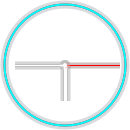

  

<h1 align="center">Time Engine</h1>

  <strong>A high-performance C++ game engine designed for sophisticated 2D application development and deterministic time manipulation.</strong>

  
  
  
  

  

---

## ⏳ The Core Vision: Time Manipulation

TimeEngine is built with a unique architectural goal: **deterministic simulation**.
While it provides a professional-grade suite for 2D development, it is being evolved to support:
- **Frame-Perfect Rewind**: Snapshot-based state management for instant time reversal.
- **Deterministic Logic**: Ensuring simulation consistency across environments.
- **Time Dilation**: Granular control over simulation speed and flow.

*Note: Time manipulation features are currently in active development. See our [Roadmap](ROADMAP.md).*

---

## ✨ Core Engine Modules

### 🖥️ Professional Editor Experience
The Time Engine workspace is built for developer productivity, featuring:
*   **Viewport Navigation**: Seamless WASD + Right-Click movement with camera speed scaling and precise zoom-to-grid mechanics.
*   **Horizontal Viewport Toolbar**: Quick-access interface for switching between selection, transform, and specialized editor modes.
*   **TEPropertyDrawer**: A modular system for generating consistent and stable property inspectors automatically.
*   **Modern Glass UI**: Translucent context menus and property panels for a clean, non-intrusive workspace.

  
  

### ⚡ Inbuilt 2D Sprite Editor & IDE (Final Stages)
A core refactor has introduced a fully data-driven, modular scripting environment within the engine:
*   **Recursive Expression Evaluator**: Supports complex nested math (e.g., `sin(a + b) * cos(c)`) with full operator precedence.
*   **Unified Block Executor**: A robust pipeline handling draw calls, assignments, and control flow (if/else, for-loops) in a single unified script.
*   **Live Code Interaction**: Automated variable registration for real-time scripting and visualization.

  

https://github.com/user-attachments/assets/a91635ad-7f87-45c2-af39-fb66095ceb2b

---

## 🛠️ Component System (ECS)
The engine utilizes a modular ECS architecture for high performance and flexibility.

### ✅ Tested & Stable
| Component | Use Case |
| :--- | :--- |
| **Box/Circle/Triangle/Polygon** | Procedural geometric shapes with integrated collision detection. |
| **LightComponent** | Point and directional lights interacting with materials for depth. |
| **TransformComponent** | Essential spatial data (X, Y, Rotation, Scale) for every entity. |
| **TagComponent** | Unique identification and organization. |

### 🛠️ Nearly Stable (Final Testing)
| Component | Use Case |
| :--- | :--- |
| **Sprite / Animated Sprite** | Texture rendering and flipbook-style animations. |
| **ProceduralSpriteComponent** | Custom, code-driven visual elements via scripting. |

### 🚧 In Development
| Component | Use Case |
| :--- | :--- |
| **Input System** | Action-based input mapping for rebindable controls. |
| **AmbientLightComponent** | Global illumination settings. |
| **ParallaxComponent** | Layered background scrolling for 2D depth. |

### 🧪 Experimental Modules
*   **Physics Engine (`PhysicsWorld`)**: Rigid body physics and simulation.
*   **Particle System**: Emitters and particle pools for visual effects.

---

### 🎨 Rendering & Lighting
*   **OpenGL 4.5 Backend**: Modern rendering techniques for maximum efficiency.
*   **Batch Rendering**: Optimized draw calls for quads, sprites, and procedural primitives.
*   **Material System**: Flexible shader and texture management via a centralized library.

  

---

## 🚀 Getting Started

1.  **Clone**: `git clone --recursive https://github.com/1SHAMAY1/TimeEngine.git`
2.  **Generate**: Run `Scripts/GenerateProjectFiles.bat` to create the Visual Studio solution.
3.  **Build**: Open `TimeEngine.sln` and build the **Sandbox** project in `Debug` or `Release`.
4.  **Launch**: Run `Sandbox.exe` to access the Project Hub.

---

## 🤝 Contributing
We welcome contributions to the renderer, component systems, or documentation. Please see [CONTRIBUTING.md](CONTRIBUTING.md) and our [Roadmap](ROADMAP.md) for more details.

---

> [!IMPORTANT]
> This engine is under **Active Development**. Modules marked as "In Development" or "Experimental" may undergo breaking changes.
